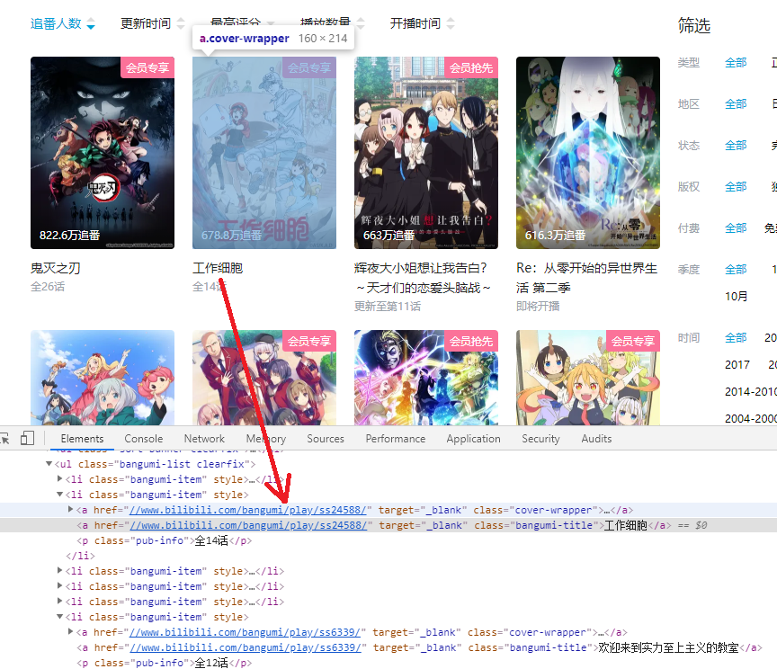

# Python爬虫+数据分析+数据可视化实战

<div class="toc">
<ul>
<li><a href="#python">Python爬虫+数据分析+数据可视化实战</a><ul>
<li><a href="#1">1. 背景介绍</a></li>
<li><a href="#2">2. 需求目标</a></li>
<li><a href="#3-urllibbangumibilibili">3. 基于urllib的bangumi和bilibili一键爬虫脚本的编写</a><ul>
<li><a href="#31-bangumi">3.1 bangumi网站分析及爬虫脚本的编写</a><ul>
<li><a href="#311">3.1.1 网站分析</a></li>
<li><a href="#312">3.1.2 代码实现</a></li>
</ul>
</li>
<li><a href="#32-bilibili">3.2 bilibili网站分析及爬虫脚本的编写</a><ul>
<li><a href="#321">3.2.1 网站分析</a></li>
<li><a href="#322">3.2.2 代码实现</a></li>
</ul>
</li>
</ul>
</li>
<li><a href="#4-pandasmatplotlib">4. 基于pandas的综合数据分析和基于matplotlib的数据可视化</a><ul>
<li><a href="#41">4.1 导入依赖库</a></li>
<li><a href="#42">4.2 数据清洗</a><ul>
<li><a href="#421">4.2.1 日期型数据处理</a></li>
<li><a href="#422-bilibili">4.2.2 bilibili评分缺失值处理</a></li>
</ul>
</li>
<li><a href="#43">4.3 基本描述统计</a><ul>
<li><a href="#431-bilibili">4.3.1 bilibili评分</a></li>
<li><a href="#432-bangumi">4.3.2 bangumi评分</a></li>
</ul>
</li>
<li><a href="#44-bangumi">4.4 bangumi动画作品数据分析</a><ul>
<li><a href="#441">4.4.1 每个动画公司各年度制作了多少动画</a></li>
<li><a href="#442">4.4.2 总的动画制作分布</a></li>
<li><a href="#443">4.4.3 每个动画公司制作的动画部数及平均评分</a></li>
<li><a href="#444-2000-2019">4.4.4 2000-2019年热门动画作品及趋势分析</a></li>
</ul>
</li>
<li><a href="#45">4.5 两站动画匹配与数据库的合并</a><ul>
<li><a href="#451">4.5.1 匹配策略</a></li>
<li><a href="#452">4.5.2 查询脚本</a></li>
<li><a href="#453">4.5.3 信息匹配</a></li>
<li><a href="#454">4.5.4 数据库合并</a></li>
</ul>
</li>
<li><a href="#46">4.6 两站评分综合分析</a><ul>
<li><a href="#461">4.6.1 相关性分析与散点图</a></li>
<li><a href="#462">4.6.2 气泡图、二维频次直方图与三维柱状图</a></li>
<li><a href="#463">4.6.3 箱线图</a></li>
<li><a href="#464">4.6.4 两网站评分特征及原因推测</a></li>
<li><a href="#465">4.6.5 总结</a></li>
</ul>
</li>
</ul>
</li>
<li><a href="#5">5 结语</a></li>
</ul>
</li>
</ul>
</div>

## 1. 背景介绍
哔哩哔哩（[www.bilibili.com](www.bilibili.com)，英文名称：bilibili，简称B站）现为中国年轻世代高度聚集的文化社区和视频平台，该网站于2009年6月26日创建。

B站早期是一个ACG（动画、漫画、游戏）内容创作与分享的视频网站。经过十年多的发展，围绕用户、创作者和内容，构建了一个源源不断产生优质内容的生态系统，B站已经涵盖7000多个兴趣圈层的多元文化社区。
哔哩哔哩作为目前国内最大的动画作品平台，已上线了3000多部来自日本、美国以及国内的动画作品，具有大量的播放、点赞、弹幕、评分等数据可供分析。

bangumi（bangumi番组计划，[bangumi.tv](https://bangumi.tv)）是专注于ACG领域的网站，是国内专业的动画评分网站。该网站可看作动画作品的数据库，拥有万余部动画作品的详细数据，包括集数、播放时间、监督以及评分、评分人数等信息等可供分析。

## 2. 需求目标

+ 编写一键爬虫脚本获取两个网站的动画作品数据
+ 对两网站的数据进行分析，其中对于评分进行相关性分析
+ 可视化展示数据

## 3. 基于urllib的bangumi和bilibili一键爬虫脚本的编写
### 3.1 bangumi网站分析及爬虫脚本的编写
#### 3.1.1 网站分析
首先打开bangumi首页，并登录。登录后刷新页面，并用fiddler抓包，获取请求头：


打开一个需要爬取的动画作品页面，需要爬取的信息有5部分：

1. 作品原名与类型
2. 作品详细信息
3. 作品简介
4. 作品tags
5. 作品评分数据


检查源代码，找到各部分对应的标签区块：

+ **part1**


+ **part2**


+ **part3**


+ **part4**


+ **part5**


获得对应的源代码位置后，便可以用beautifulsoup包对网页html进行解析获取数据了。

目前的问题是如何获取尽量多的作品数据。

根据网页地址，访问某部作品的页面应为`bangumi.tv/subject/…`\(后面的数字称为**subject号**\)，所以可以从1开始遍历所有的subject号，这理论上可行，但实际操作中发现了两个问题，一是subject号目前超过20万，全部遍历所需时间太长；二是并不是所有作品都是动画作品，还可能是书籍、音乐、游戏等：

+ **例：漫画**


+ **例：专辑**


所以必须找到其他方法。注意到bangumi作为评分网站具有**排行榜**功能：


该排行榜收录了所有评分人数达到最低评分人数的动画，默认按照评分从高到低排序。截至2020年6月26日，共有5831部动画在榜。并且榜单分为243页，全部可以直接访问爬取subject号：


不需通过ajax请求获取某段排行的数据，这对于爬虫是非常友好的。

考虑到能上榜的作品都具有一定人气，并且只有评分人数达到一定数量评分才更有代表性，所以决定按照排行榜爬取这5800多部动画作品subject号，再访问各自的页面获取详细信息。

---
#### 3.1.2 代码实现

1. **模块的导入**

```python
import numpy as np
import pandas as pd

from bs4 import BeautifulSoup as bs
import urllib.request as ur
import urllib.parse as up
import urllib.error as ue
import http.cookiejar as hc

import re
import gzip
import json

import time
import os
import socket

os.chdir('...')
socket.setdefaulttimeout(30)

```

2. **总榜subject号爬取**

```python
# 设置请求头
headers={
    'Host': 'bangumi.tv',
    'Connection': 'keep-alive',
    'Cache-Control': 'max-age=0',
    'Upgrade-Insecure-Requests': '1',
    'User-Agent': 'Mozilla/5.0 (Windows NT 10.0; Win64; x64) AppleWebKit/537.36 (KHTML, like Gecko) Chrome/80.0.3987.132 Safari/537.36',
    'Sec-Fetch-Dest': 'document',
    'Accept': 'text/html,application/xhtml+xml,application/xml;q=0.9,image/webp,image/apng,*/*;q=0.8,application/signed-exchange;v=b3;q=0.9',
    'Sec-Fetch-Site': 'none',
    'Sec-Fetch-Mode': 'navigate',
    'Sec-Fetch-User': '?1',
    'Accept-Encoding': 'gzip',
    'Accept-Language': 'zh-CN,zh;q=0.9',
    'Cookie': '...(此处略去)...__utmb=1.7.10.1593136256'
}
# 创建cookiejar对象
cj=hc.CookieJar()
# 根据cookiejar创建handler对象
hl=ur.HTTPCookieProcessor(cj)
# 根据handler创建opener对象
opener=ur.build_opener(hl)

# 设定字符匹配模式将subject号匹配
pattern=re.compile(r'li id="item_(\d+)"')
# 储存subject号的列表
subjectlist=[]

# 更新cookie的函数（反爬机制之一）
def update_cookie(cookie=str()):
    return cookie[:cookie.rfind('utmb=')]+cookie[cookie.rfind('utmb='):].split('.')[0]+'.'+str(int(cookie[cookie.rfind('utmb='):].split('.')[1])+1)+'.'+cookie[cookie.rfind('utmb='):].split('.')[2]+'.'+cookie[cookie.rfind('utmb='):].split('.')[3]

# 爬取subject号的函数
def bangumidownload(start,end,subjectlist):
    for i in range(start,end+1):
        url='https://bangumi.tv/anime/browser?sort=rank&page=%d'%(i)# 爬取排行榜每页信息
        print('downloading page',i,end='\r')
        
        try_time=0
        while try_time<=5:
            try:
                r=ur.Request(url=url,headers=headers)
                response=opener.open(r) 
                break
            except Exception as e:
                try_time+=1
                if try_time>1:
                    headers['Cookie']=update_cookie(headers['Cookie'])
                print('retrying with cookie=',headers['Cookie'][headers['Cookie'].rfind('utmb='):],try_time)
        else:
            raise Exception('Download Failed!!')
            
        content=str(gzip.decompress(response.read()),'utf-8')# 解码
        response.close()

        thispage=re.findall(pattern,content)# 找到所有匹配结果
        
        subjectlist.extend(thispage)

bangumidownload(1,243,subjectlist)

# 保存至文件
date=str(time.localtime().tm_mon)+'_'+str(time.localtime().tm_mday)
with open(r'bangumi\subjectlist_'+date+'.json','w') as fp:
    json.dump(subjectlist,fp)
```
3. **详细信息爬取**

```python
bgmdb=[] #保存数据的列表

picpattern=re.compile(r'href="//(.*?)"') #图片链接匹配模式

def bangumifulldownload(bgmsubjects):
    for i in bgmsubjects:
        url='https://bangumi.tv/subject/'+i
        print('downloading subject '+i)
        
        try_time=0
        while try_time<=5:
            try:
                r=ur.Request(url=url,headers=headers)
                response=opener.open(r,timeout=30) 
                break
            except Exception as e:
                try_time+=1
                if try_time>2:
                    headers['Cookie']=update_cookie(headers['Cookie'])
                print('retrying with cookie=',headers['Cookie'][headers['Cookie'].rfind('utmb='):],try_time)
        else:
            raise Exception('Download Failed!!')
            
        content=str(gzip.decompress(response.read()),'utf-8')
        response.close()

        soup=bs(content)
        mainWrapper=soup.find('div',class_='mainWrapper')
        name=soup.find('h1',class_='nameSingle')
        if mainWrapper==None or name==None:
            continue
        
        infobox=mainWrapper.find('ul',id='infobox')
        if infobox==None:
            continue
        infodict=dict()
        infodict.update({'subject':i,'原名':name.find('a').text if name.find('a')!=None else '',
                         '类型':name.find('small').text if name.find('small')!=None else ''})
        
        summary=mainWrapper.find('div',id='subject_summary')
        if summary is not None:
            infodict.update({'简介':summary.text})

        pic=mainWrapper.find('a',class_='thickbox cover')
        if pic is not None:
            pic=re.findall(picpattern,str(pic))
            if len(pic):
                infodict.update({'封面':'https://'+pic[0]})
        
        info=infobox.find_all('li')
        for each_info in info:
            kv=each_info.text.split(':',maxsplit=1)
            infodict.update({kv[0].strip():kv[1].strip()})
        
        tagWrapper=mainWrapper.find('div',class_='inner')
        if tagWrapper==None:
            continue
        tagtext=tagWrapper.select('.l span,a small')
        tags=[]
        for everytag in tagtext:
            tags.append(everytag.text)
        tags=' '.join(tags)
        infodict.update({'tags':tags})
        
        chartWrapper=mainWrapper.find('div',id='ChartWarpper')
        infodict.update({'votes':chartWrapper.find('span',property='v:votes').text})
        
        rating_list=[]
        for each_rater in chartWrapper.find_all('span',{'class':'count'}):
            rating_list.append(each_rater.text[1:-1])
        infodict.update({'ratings':rating_list})
        
        # 计算平均分
        overall_score=0
        overall_vote=0
        for score in range(10,0,-1):
            overall_vote+=int(infodict['ratings'][10-score])
            overall_score+=score*int(infodict['ratings'][10-score])
        overall_score=overall_score/overall_vote
        infodict.update({'rating':str('%.3f'%(overall_score))})
        
        print(infodict)
        bgmdb.append(infodict)

bangumifulldownload(subjectlist)
# 保存至文件
date=str(time.localtime().tm_mon)+'_'+str(time.localtime().tm_mday)
with open(r'bangumi\bgmdb_'+date+'.json','w') as fp:
    json.dump(bgmdb,fp)
```

4. **数据初步清洗**

```python
# 读取获得的原始数据
bgmfulldb=pd.read_json(r'bangumi\bgmdb_'+date+'.json')
# 选取非空值数最少的60个键，将键值对复制到新的列表中（进行了初步清洗）
indexs=bgmfulldb[~bgmfulldb.isna()].count().sort_values(ascending=False)[:60].index

bgmdb2=[]
for i in bgmdb:
    thisanime=[]
    
    for each_key in indexs:
        if each_key in i.keys():
            thisanime.append(i[each_key])
        else:
            thisanime.append('')
    
    bgmdb2.append(thisanime)
# 转化成DataFrame格式并转存为csv格式文件
bgmdb2=pd.DataFrame(bgmdb2,columns=indexs)
bgmdb2.to_csv(r'bangumi\bgmdb_'+date+'.csv',index=False)
```
初步清洗后的数据格式如下：

<table border="0" class="dataframe">
  <thead>
    <tr style="text-align: right;">
      <th></th>
      <th>votes</th>
      <th>原名</th>
      <th>类型</th>
      <th>封面</th>
      <th>tags</th>
      <th>rating</th>
      <th>ratings</th>
      <th>话数</th>
      <th>简介</th>
      <th>中文名</th>
      <th>...</th>
      <th>主题歌作曲</th>
      <th>主题歌作词</th>
      <th>开始</th>
      <th>结束</th>
      <th>片长</th>
      <th>主题歌编曲</th>
      <th>第二原画</th>
      <th>音响</th>
      <th>特效</th>
      <th>机械设定</th>
    </tr>
    <tr>
      <th>subject</th>
      <th></th>
      <th></th>
      <th></th>
      <th></th>
      <th></th>
      <th></th>
      <th></th>
      <th></th>
      <th></th>
      <th></th>
      <th></th>
      <th></th>
      <th></th>
      <th></th>
      <th></th>
      <th></th>
      <th></th>
      <th></th>
      <th></th>
      <th></th>
      <th></th>
    </tr>
  </thead>
  <tbody>
    <tr>
      <th>253</th>
      <td>7016</td>
      <td>カウボーイビバップ</td>
      <td>TV</td>
      <td>https://lain.bgm.tv/pic/cover/l/c2/4c/253_t3XW...</td>
      <td>渡边信一郎 2293 菅野洋子 2196 星际牛仔 1529 经典 1139 SUNRISE...</td>
      <td>9.143</td>
      <td>['3325', '2252', '977', '287', '88', '37', '9'...</td>
      <td>26</td>
      <td>2021年，随着超光速航行技术的实现，人类得以在太阳系范围内方便的自由移动，但...</td>
      <td>星际牛仔</td>
      <td>...</td>
      <td>菅野よう子</td>
      <td>NaN</td>
      <td>NaN</td>
      <td>NaN</td>
      <td>NaN</td>
      <td>菅野よう子</td>
      <td>NaN</td>
      <td>NaN</td>
      <td>長谷川敏生</td>
      <td>山根公利</td>
    </tr>
    <tr>
      <th>326</th>
      <td>3968</td>
      <td>攻殻機動隊 S.A.C. 2nd GIG</td>
      <td>TV</td>
      <td>https://lain.bgm.tv/pic/cover/l/a6/66/326_M9f1...</td>
      <td>菅野洋子 957 攻殻機動隊 871 神山健治 762 攻壳机动队 668 科幻 619 押...</td>
      <td>9.129</td>
      <td>['1773', '1359', '623', '129', '44', '12', '3'...</td>
      <td>26</td>
      <td>这个世界距离我们并不遥远，你把它看作是现代社会的镜子亦为不可。\r\n也许：无论人类怎样发展...</td>
      <td>攻壳机动队 S.A.C. 2nd GIG</td>
      <td>...</td>
      <td>菅野よう子</td>
      <td>Origa</td>
      <td>NaN</td>
      <td>NaN</td>
      <td>NaN</td>
      <td>菅野よう子</td>
      <td>NaN</td>
      <td>NaN</td>
      <td>村上正博</td>
      <td>常木志伸、寺岡賢司</td>
    </tr>
    <tr>
      <th>324</th>
      <td>4896</td>
      <td>攻殻機動隊 STAND ALONE COMPLEX</td>
      <td>TV</td>
      <td>https://lain.bgm.tv/pic/cover/l/f2/fc/324_psuX...</td>
      <td>攻壳机动队 1606 菅野洋子 1215 科幻 926 神山健治 852 士郎正宗 775 ...</td>
      <td>9.081</td>
      <td>['2036', '1780', '790', '172', '61', '26', '5'...</td>
      <td>26</td>
      <td>公元2030的世界，改造人、生化人、机器人等等的存在已经非常普及。主人公草薙素子正是人类最高...</td>
      <td>攻壳机动队 STAND ALONE COMPLEX</td>
      <td>...</td>
      <td>菅野よう子</td>
      <td>Origa</td>
      <td>NaN</td>
      <td>NaN</td>
      <td>NaN</td>
      <td>菅野よう子</td>
      <td>NaN</td>
      <td>NaN</td>
      <td>遠藤誠、村上正博</td>
      <td>寺岡賢司、常木志伸</td>
    </tr>
  </tbody>
</table>


### 3.2 bilibili网站分析及爬虫脚本的编写
#### 3.2.1 网站分析
bilibili的动画作品分处于番剧（国外作品）区与国创（国内作品）区，故主要对这两个区进行分析。


进入番剧区后，点击“番剧索引”，可以发现与bangumi类似的页面，在这个页面同样可以获取到所有上线的国外动画作品（国创区同理）：


每个作品对应一个链接: `https://www.bilibili.com/bangumi/play/ss...`（ss后面的数字称为**ss号**）



打开其中一个作品，进入播放页面，在这个页面上可以看到播放量、弹幕数、追番人数、作品类型、完结情况、集数、简介、评分与评分人数等信息：


对该网页进行抓包，尝试获取以上信息：


可以发现，响应中有一些信息，但是缺少播放数、弹幕数等信息，说明网页不是一次性加载出来的。在抓包界面可以看到很多`data.bilibili.com`的请求，估计是获取更多的页面数据，比如视频源信息等。
在所有抓包结果中搜索弹幕数1126，找到了对应的api接口：`api.bilibili.com/pgc/web/season/stat?season_id=…`，该接口返回一个json格式字符串，存有精确的播放量、弹幕数等信息（但没有评分信息）：


请求中的season_id即为前述的ss号。
继续搜索评分9.2，发现另一个api：`api.bilibili.com /pgc/review/user?media_id=…&ts=…`
请求链接中的media_id下称为**md号**。


该api提供了详尽的作品信息，包括地区、封面链接、评分、标题、类型，还包含一个ss链接。
由于在初始网页`https://www.bilibili.com/bangumi/play/ss...`中可以找到md号，故设计以下爬虫流程：

**爬取ss号--访问ss页面获取作品简介和md号--根据ss号和md号访问相应的api获取详细信息。**

最后，访问该json中的share_url，打开的页面为该作品的介绍界面，包含作品开播日期、完结情况、tags等：


找到对应的位置：


故可以访问该页面获取tags、日期、话数。

对于bilibili网站，总的爬虫流程设计如下:

**从索引页面爬取ss号---访问ss页面获取作品简介和md号---根据ss号和md号访问相应的api获取详细信息---访问md页面获取作品开播日期和话数---爬取封面图。**

#### 3.2.2 代码实现

1. **模块的导入**

```python
import numpy as np
import pandas as pd

from bs4 import BeautifulSoup as bs
import urllib.request as ur
import urllib.parse as up
import urllib.error as ue
import http.cookiejar as hc

import re
import gzip
import json

import time
import os
import socket

os.chdir(r'...')
socket.setdefaulttimeout(30)
```

2. **配置爬虫条件**

```python
# 设置请求头
# api请求头
apiheaders={
    'Host': 'api.bilibili.com',
    'Connection': 'keep-alive',
    'Cache-Control': 'max-age=0',
    'Upgrade-Insecure-Requests': '1',
    'Accept':' application/json, text/plain, */*',
    'Sec-Fetch-Dest': 'empty',
    'User-Agent': 'Mozilla/5.0 (Windows NT 10.0; Win64; x64) AppleWebKit/537.36 (KHTML, like Gecko) Chrome/80.0.3987.132 Safari/537.36',
    'Origin': 'https://www.bilibili.com',
    'Sec-Fetch-Site': 'same-site',
    'Sec-Fetch-User': '?1',
    'Sec-Fetch-Mode': 'cors',
    'Sec-Fetch-Dest': 'document',
    'Referer': 'https://www.bilibili.com/anime/index/',
    'Accept-Encoding': 'gzip, deflate, br',
    'Accept-Language': 'zh-CN,zh;q=0.9',
    'Cookie':cookie
}
# 网页请求头
wwwheaders={
    'Host': 'www.bilibili.com',
    'Connection': 'keep-alive',
    'Cache-Control': 'max-age=0',
    'Upgrade-Insecure-Requests': '1',
    'User-Agent': 'Mozilla/5.0 (Windows NT 10.0; Win64; x64) AppleWebKit/537.36 (KHTML, like Gecko) Chrome/80.0.3987.132 Safari/537.36',
    'Sec-Fetch-Dest': 'document',
    'Accept': 'text/html,application/xhtml+xml,application/xml;q=0.9',
    'Sec-Fetch-Site': 'same-origin',
    'Sec-Fetch-Mode': 'navigate',
    'Sec-Fetch-User': '?1',
    'Referer': 'https://www.bilibili.com/anime/index/',
    'Accept-Encoding': 'gzip, deflate, br',
    'Accept-Language': 'zh-CN,zh;q=0.9',
    'Cookie':cookie
}
# 图片请求头
imageheaders={
    'Host': 'i0.hdslb.com',
    'Connection': 'keep-alive',
    'User-Agent': 'Mozilla/5.0 (Windows NT 10.0; Win64; x64) AppleWebKit/537.36 (KHTML, like Gecko) Chrome/80.0.3987.132 Safari/537.36',
    'Sec-Fetch-Dest': 'image',
    'Accept': 'image/webp,image/apng,image/*,*/*;q=0.8',
    'Sec-Fetch-Site': 'cross-site',
    'Sec-Fetch-Mode': 'no-cors',
    'Referer': 'https://www.bilibili.com/bangumi/media/md1178/?from=search&seid=17806546061422186816',
    'Accept-Encoding': 'gzip, deflate, br',
    'Accept-Language': 'zh-CN,zh;q=0.9'
}
# 创建cookiejar对象
cj=hc.CookieJar()
# 根据cookiejar创建handler对象
hl=ur.HTTPCookieProcessor(cj)
# 根据handler创建opener对象
opener=ur.build_opener(hl)
```

3. **爬取ss号**

```python
sslist=list()

pattern=re.compile(r'https://www.bilibili.com/bangumi/play/ss\d+')
pattern2=re.compile(r'"title":"(.*?)"')
# 番剧区索引
def ssdownload():
    for i in range(1,1000):
        url='https://api.bilibili.com/pgc/season/index/result?season_version=-1&area=-1&is_finish=-1&copyright=-1&season_status=-1&season_month=-1&year=-1&style_id=-1&order=5&st=1&sort=0&page='+str(i)+'&season_type=1&pagesize=20&type=1'
        print('downloading page='+str(i))
        
        try_time=0
        while try_time<=5:
            try:
                r=ur.Request(url=url,headers=headers)
                response=opener.open(r) 
                break
            except ue.HTTPError as e:
                print('Page Not found...skipped')
                break
            except Exception as e:
                try_time+=1
                print('retrying',try_time)
        else:
            raise Exception('Download Failed!!')
        
        
        try:
            content=str(gzip.decompress(response.read()),'utf-8')
        except Exception as e:
            break
            
        response.close()
        
        titles=re.findall(pattern2,content)
        ssurl=re.findall(pattern,content)
        
        
        for i in range(len(ssurl)):
            sslist.append({'title':titles[i],'ssurl':ssurl[i]}) 
# 国创区索引
def ssdownload2():
    for i in range(1,1000):
        url='https://api.bilibili.com/pgc/season/index/result?season_version=-1&is_finish=-1&copyright=-1&season_status=-1&year=-1&style_id=-1&order=5&st=4&sort=0&page='+str(i)+'&season_type=4&pagesize=20&type=1'
        print('downloading page='+str(i))
        
        try_time=0
        while try_time<=5:
            try:
                r=ur.Request(url=url,headers=headers)
                response=opener.open(r) 
                break
            except ue.HTTPError as e:
                print('Page Not found...skipped')
                break
            except Exception as e:
                try_time+=1
                print('retrying',try_time)
        else:
            raise Exception('Download Failed!!')
        
        
        try:
            content=str(gzip.decompress(response.read()),'utf-8')
        except Exception as e:
            break
            
        response.close()
        
        titles=re.findall(pattern2,content)
        ssurl=re.findall(pattern,content)
        
        
        for i in range(len(ssurl)):
            sslist.append({'title':titles[i],'ssurl':ssurl[i]}) 

ssdownload()
ssdownload2()
```

3. **访问ss链接获取md号与简介**

```python
mdpattern=re.compile('\d+')
mdlist=[]
summary_dict={}
def mddownload():
    for each_ssurl in sslist:
        print('downloading item='+str(sslist.index(each_ssurl)))
        
        try_time=0
        httperror=False
        while try_time<=5:
            try:
                r=ur.Request(url=each_ssurl['ssurl'],headers=wwwheaders)
                response=opener.open(r) 
                break
            except ue.HTTPError as e:
                httperror=True
                print('Page Not found...skipped')
                break
            except Exception as e:
                try_time+=1
                print('retrying',try_time)
        else:
            raise Exception('Download Failed!!')
        
        if httperror:
            continue
        
        content=str(gzip.decompress(response.read()),'utf-8')
        response.close()
        
        soup=bs(content)
        
        mdlist.append(re.search(mdpattern,str(soup.find('div', id='media_module').find('a'))).group())
        summary_dict.update({mdlist[-1]:soup.find('span',class_='absolute').text})

mddownload()
mdlist=sorted(mdlist)
```
4. **访问api**

```python
bilidb=list()
for i in mdlist:
    url='https://api.bilibili.com/pgc/review/user?media_id='+str(i)
    r=ur.Request(url=url,headers=apiheaders)
    response=opener.open(r)
    content=str(response.read(),'utf-8')
    mdjson=json.loads(content)
    
    if 'result' in mdjson.keys():
        if 'media' in mdjson['result'].keys():
            url='https://api.bilibili.com/pgc/web/season/stat?season_id='+str(mdjson['result']['media']['season_id'])
            r=ur.Request(url=url,headers=headers)
            response=opener.open(r)
            content=str(response.read(),'utf-8')
            mdjson2=json.loads(content)
            mdjson['result'].update(mdjson2['result'])
    
    bilidb.append(mdjson['result'] if 'result' in mdjson.keys() else dict())
    print(mdlist.index(i),end='\r')
```

5. **访问md页面获取日期、集数、tags**

```python
tp_finished=re.compile(r'(\d+)年(\d+)月(\d+)日开播.*(\d+)')
tp_not_finished=re.compile(r'(\d+)年(\d+)月(\d+)日开播')
tp_movie=re.compile(r'(\d+)年(\d+)月(\d+)日上映')
def download():
    for i in range(len(bilidb)):
        print(i,end='\r')
        
        if 'media' not in bilidb[i].keys():
            continue
        url=bilidb[i]['media']['share_url']
        
        try_time=0
        httperror=False
        while try_time<=5:
            try:
                r=ur.Request(url=url,headers=wwwheaders)
                response=opener.open(r) 
                break
            except ue.HTTPError as e:
                httperror=True
                print('Page Not found...skipped')
                break
            except Exception as e:
                try_time+=1
                print('retrying',try_time)
        else:
            raise Exception('Download Failed!!')
        
        if httperror:
            continue
        
        content=str(gzip.decompress(response.read()),'utf-8')
        response.close()
        
        soup=bs(content)
        tags=soup.find('div',class_='media-info-r').find_all('span',{'class':'media-tag'})
        tags=[each_tag.text for each_tag in tags]
        tags=' '.join(tags) if len(tags) else ''
        time=soup.find('div',class_='media-info-r').find_all('div',{'class':'media-info-time'})[0]
        
        res=re.search(tp_finished,time.text)
        finished=False
        if res is not None: # finished
            finished=True
            res=res.groups()
            date='-'.join(res[0:3])
            episodes=res[3]
        else:
            res=re.search(tp_not_finished,time.text)
            if res is not None: # not_finished
                res=res.groups()
                date='-'.join(res[0:3])
                episodes=0
            else:
                res=re.search(tp_movie,time.text)
                if res is not None: # a_movie
                    res=res.groups()
                    date='-'.join(res[0:3])
                    episodes=1
                else:
                    date=''
                    episodes=-1
        
        bilidb[i].update({'tags':tags,'date':date,'episodes':episodes})
        print(i,{'tags':tags,'date':date,'episodes':episodes})
download()
```

6. **数据初步清洗**

```python
bilidb2=[]
for i in range(len(bilidb)):
    a=dict()
    if not len(bilidb[i]):
        continue
    a.update({
            'title':bilidb[i]['media']['title'],
            'type_name':bilidb[i]['media']['type_name'],
            'season_id':bilidb[i]['media']['season_id'],
            'area':bilidb[i]['media']['areas'][0]['name'] if len(bilidb[i]['media']['areas'])>0 else '',
            'media_id':bilidb[i]['media']['media_id'],
            'rating':bilidb[i]['media']['rating']['score'] if 'rating' in bilidb[i]['media'].keys() else 0,
            'raters':bilidb[i]['media']['rating']['count'] if 'rating' in bilidb[i]['media'].keys() else 0,
            'cover':bilidb[i]['media']['cover'],
        
            'follow':bilidb[i]['follow'] if 'follow' in bilidb[i].keys() else 0,
            'series_follow':bilidb[i]['series_follow'] if 'series_follow' in bilidb[i].keys() else 0,
            'views':bilidb[i]['views'] if 'views' in bilidb[i].keys() else 0,
            'coins':bilidb[i]['coins'] if 'coins' in bilidb[i].keys() else 0,
            'danmakus':bilidb[i]['danmakus'] if 'danmakus' in bilidb[i].keys() else 0,
            'tags':bilidb[i]['tags'] if 'tags' in bilidb[i].keys() else '',
            'date':bilidb[i]['date'] if 'date' in bilidb[i].keys() else '',
            'episodes':bilidb[i]['episodes'] if 'episodes' in bilidb[i].keys() else 0
             })
    bilidb2.append(a)
# 添加简介
for each_item in bilidb2:
    summary=summary_dict.get(str(each_item['media_id']))
    each_item.update({'简介':summary if summary is not None else ''})

date=str(time.localtime().tm_mon)+'_'+str(time.localtime().tm_mday)
with open(r'bilibili\sslist_'+date+'.json','w') as fp:
    json.dump(sslist,fp)
with open(r'bilibili\mdlist_'+date+'.json','w') as fp:
    json.dump(mdlist,fp)
with open(r'bilibili\bilidb_'+date+'.json','w') as fp:
    json.dump(bilidb2,fp)

bilidb3=pd.DataFrame(bilidb2)
bilidb3.to_csv(r'bilibili\bilidb_'+date+'.csv',index=False)
```

初步清洗后的数据格式如下：

<table border="0" class="dataframe">
  <thead>
    <tr style="text-align: right;">
      <th></th>
      <th>title</th>
      <th>type_name</th>
      <th>season_id</th>
      <th>area</th>
      <th>media_id</th>
      <th>rating</th>
      <th>raters</th>
      <th>cover</th>
      <th>follow</th>
      <th>series_follow</th>
      <th>views</th>
      <th>coins</th>
      <th>danmakus</th>
      <th>tags</th>
      <th>date</th>
      <th>episodes</th>
      <th>简介</th>
    </tr>
  </thead>
  <tbody>
    <tr>
      <th>160</th>
      <td>散华礼弥</td>
      <td>番剧</td>
      <td>710</td>
      <td>日本</td>
      <td>710</td>
      <td>9.4</td>
      <td>8016</td>
      <td>http://i0.hdslb.com/bfs/bangumi/6dccd70827dd5f...</td>
      <td>1124707</td>
      <td>1124705</td>
      <td>4384323</td>
      <td>38564</td>
      <td>255295</td>
      <td>奇幻 日常 治愈</td>
      <td>2012-4-5</td>
      <td>4</td>
      <td>毫无特色的少年降谷千纮，就读于县立紫阳高校一年级，是个非常喜爱僵尸的人。少女散华礼弥是散华家...</td>
    </tr>
    <tr>
      <th>161</th>
      <td>恋爱随意链接</td>
      <td>番剧</td>
      <td>713</td>
      <td>日本</td>
      <td>713</td>
      <td>9.5</td>
      <td>9269</td>
      <td>http://i0.hdslb.com/bfs/bangumi/8274f1107032a6...</td>
      <td>730312</td>
      <td>730313</td>
      <td>3206322</td>
      <td>33427</td>
      <td>219865</td>
      <td>日常 少女 校园 小说改</td>
      <td>2012-7-7</td>
      <td>7</td>
      <td>故事发生在私立山星高中，这所学校的文化研究部内，八重樫太一、永濑伊织、稻叶姬子、桐山唯、...</td>
    </tr>
    <tr>
      <th>162</th>
      <td>猫物语（黑）</td>
      <td>番剧</td>
      <td>723</td>
      <td>日本</td>
      <td>723</td>
      <td>9.7</td>
      <td>1926</td>
      <td>http://i0.hdslb.com/bfs/bangumi/d24e532a91234b...</td>
      <td>433136</td>
      <td>433079</td>
      <td>811255</td>
      <td>4162</td>
      <td>12484</td>
      <td>奇幻 声控 小说改 神魔</td>
      <td>2012-12-31</td>
      <td>4</td>
      <td>黄金周的第一天，阿良良木历和班长羽川翼一起埋葬了一只被车碾过，没有尾巴的猫。这本应是一件的普...</td>
    </tr>
  </tbody>
</table>

7. **封面图下载**

```python
def imgdl():
    for i in range(len(bilidb)):
        print(i,end='\r')
        url=bilidb.cover.values[i]
        md=bilidb.media_id.values[i]
        
        try_time=0
        httperror=False
        while try_time<=5:
            try:
                r=ur.Request(url=url,headers=headers)
                response=opener.open(r) 
                break
            except ue.HTTPError as e:
                httperror=True
                print('Page Not found...skipped')
                break
            except Exception as e:
                try_time+=1
                print('retrying',try_time)
        else:
            raise Exception('Download Failed!!')


        content=response.read()
        response.close()
        
        with open('bilibili\\covers\\' + str(md) + '.jpg','wb') as fp:
            fp.write(content)
```

## 4. 基于pandas的综合数据分析和基于matplotlib的数据可视化
### 4.1 导入依赖库

```python
import numpy as np
import pandas as pd
from scipy import stats
import matplotlib.pyplot as plt
import time
import os
from bs4 import BeautifulSoup as bs
import urllib.request as ur
import urllib.parse as up
import urllib.error as ue
import http.cookiejar as hc

import re
import gzip

import json
%matplotlib inline
plt.rcParams['font.sans-serif']=['SimHei'] #解决符号乱码问题
plt.rcParams['axes.unicode_minus']=False #解决中文乱码问题
os.chdir(r'...')
```

### 4.2 数据清洗
#### 4.2.1 日期型数据处理

对于bilibili的日期格式：
```python
bilidb.date
```
```bash
0        2013-1-3
1        2014-7-8
2        2014-7-2
3       2012-10-7
4        2013-7-7
          ...    
3703          NaN
3704          NaN
3705          NaN
3706          NaN
3707          NaN
Name: date, Length: 3708, dtype: object
```
先将其转换为datetime格式：
```python
bilidb.date=pd.to_datetime(bilidb.date,format='%Y-%m-%d',errors='coerce').copy()
bilidb.date
```
```bash
0      2013-01-03
1      2014-07-08
2      2014-07-02
3      2012-10-07
4      2013-07-07
          ...    
3703          NaT
3704          NaT
3705          NaT
3706          NaT
3707          NaT
Name: date, Length: 3708, dtype: datetime64[ns]
```
再提取出年份，并转换为int格式，缺失值设为0：
```python
bilidb['year']=bilidb.date.apply(lambda x: x.year)
bilidb.year=bilidb.year.apply(lambda x: 0 if not pd.notna(x) else int(x))
bilidb.year
```
```bash
0       2013
1       2014
2       2014
3       2012
4       2013
        ... 
3703       0
3704       0
3705       0
3706       0
3707       0
Name: date, Length: 3708, dtype: int64
```
对于bangumi，由于多集动画和单集电影的播出时间分处于`放送开始`和`上映年度`两个键中，故需将其合并后处理。

<table border="0" class="dataframe">
  <thead>
    <tr style="text-align: right;">
      <th></th>
      <th>放送开始</th>
      <th>上映年度</th>
    </tr>
  </thead>
  <tbody>
    <tr>
      <th>0</th>
      <td>1998年10月23日</td>
      <td>NaN</td>
    </tr>
    <tr>
      <th>1</th>
      <td>2004年1月1日</td>
      <td>NaN</td>
    </tr>
    <tr>
      <th>2</th>
      <td>2002年10月1日</td>
      <td>NaN</td>
    </tr>
    <tr>
      <th>3</th>
      <td>2008年10月2日</td>
      <td>NaN</td>
    </tr>
    <tr>
      <th>4</th>
      <td>1995年10月4日</td>
      <td>NaN</td>
    </tr>
    <tr>
      <th>5</th>
      <td>NaN</td>
      <td>1995年11月18日</td>
    </tr>
    <tr>
      <th>6</th>
      <td>NaN</td>
      <td>1997年7月19日</td>
    </tr>
    <tr>
      <th>7</th>
      <td>NaN</td>
      <td>NaN</td>
    </tr>
    <tr>
      <th>8</th>
      <td>2009年4月5日</td>
      <td>NaN</td>
    </tr>
    <tr>
      <th>9</th>
      <td>2017年10月14日</td>
      <td>NaN</td>
    </tr>
  </tbody>
</table>

```python
# 新建一列，将上映年度和放送开始看做同一类型
bgmdb['日期']=pd.to_datetime(bgmdb['放送开始'],format='%Y年%m月%d日',errors='coerce')
bgmdb['日期2']=pd.to_datetime(bgmdb['上映年度'],format='%Y年%m月%d日',errors='coerce')
# 合并日期数据
for i in range(len(bgmdb['日期'])):
    if bgmdb['日期'][i] is pd.NaT:
        bgmdb.loc[i,'日期']=bgmdb.loc[i,'日期2']
bgmdb.drop('日期2',axis=1,inplace=True)
# 新增年度数据
bgmdb['年度']=0
for i in range(len(bgmdb)):
    bgmdb.loc[i,'年度']=bgmdb.loc[i,'日期'].year if bgmdb.loc[i,'日期'] is not pd.NaT else 0
    
bgmdb[['放送开始','上映年度','日期','年度']].head(10)
```
<table border="0" class="dataframe">
  <thead>
    <tr style="text-align: right;">
      <th></th>
      <th>放送开始</th>
      <th>上映年度</th>
      <th>日期</th>
      <th>年度</th>
    </tr>
  </thead>
  <tbody>
    <tr>
      <th>0</th>
      <td>1998年10月23日</td>
      <td>NaN</td>
      <td>1998-10-23</td>
      <td>1998</td>
    </tr>
    <tr>
      <th>1</th>
      <td>2004年1月1日</td>
      <td>NaN</td>
      <td>2004-01-01</td>
      <td>2004</td>
    </tr>
    <tr>
      <th>2</th>
      <td>2002年10月1日</td>
      <td>NaN</td>
      <td>2002-10-01</td>
      <td>2002</td>
    </tr>
    <tr>
      <th>3</th>
      <td>2008年10月2日</td>
      <td>NaN</td>
      <td>2008-10-02</td>
      <td>2008</td>
    </tr>
    <tr>
      <th>4</th>
      <td>1995年10月4日</td>
      <td>NaN</td>
      <td>1995-10-04</td>
      <td>1995</td>
    </tr>
    <tr>
      <th>5</th>
      <td>NaN</td>
      <td>1995年11月18日</td>
      <td>1995-11-18</td>
      <td>1995</td>
    </tr>
    <tr>
      <th>6</th>
      <td>NaN</td>
      <td>1997年7月19日</td>
      <td>1997-07-19</td>
      <td>1997</td>
    </tr>
    <tr>
      <th>7</th>
      <td>NaN</td>
      <td>NaN</td>
      <td>NaT</td>
      <td>0</td>
    </tr>
    <tr>
      <th>8</th>
      <td>2009年4月5日</td>
      <td>NaN</td>
      <td>2009-04-05</td>
      <td>2009</td>
    </tr>
    <tr>
      <th>9</th>
      <td>2017年10月14日</td>
      <td>NaN</td>
      <td>2017-10-14</td>
      <td>2017</td>
    </tr>
  </tbody>
</table>

#### 4.2.2 bilibili评分缺失值处理

需要将评分人数不足的作品的评分及评分人数从0改为nan，以便后面进行剔除：

```python
bilidb.rating=bilidb.rating.apply(lambda x: np.nan if x==0 else x)
bilidb.raters=bilidb.raters.apply(lambda x: np.nan if x==0 else x)
```

### 4.3 基本描述统计
#### 4.3.1 bilibili评分

+ 平均数、中位数

```python
(len(bilidb.rating),
 bilidb.rating.dropna().describe(),
 bilidb.rating[bilidb.rating==bilidb.rating.mode()[0]].count())
```

```bash
(3708,
 count    2581.00000
 mean        9.12592
 std         1.01527
 min         2.20000
 25%         9.10000
 50%         9.50000
 75%         9.70000
 max         9.90000
 Name: rating, dtype: float64,
 431)
```

即在3708部作品中，有2581部有评分，且平均分为9.12分，中位数为9.5分（共431部作品）。

+ 频数分布直方图、正态分布曲线

```python
fig=plt.figure(num=100,figsize=(6,4),dpi=200)
ax=fig.gca()

nx=np.arange(2,11,0.1)
ny=normfun(nx,bilidb.rating.dropna().mean(),bilidb.rating.dropna().std())
ax.plot(nx,ny)

ax.hist(x=bilidb.rating.dropna(),bins=20,color='yellow',edgecolor='black',density=True)
ax.set_title('bilibili评分频数分布直方图与正态分布曲线')
ax.text(2.5,0.8,'average=%.4f\nstd=%.4f'%(bilidb.rating.dropna().mean(),bilidb.rating.dropna().std()),fontsize=15)
```


可以看出评分的分布与正态分布相差较大。

+ 票均平均分

```python
(bilidb.raters.dropna().sum(),
 (bilidb.rating.dropna()*bilidb.raters.dropna()).sum()/bilidb.raters.sum())
```
```bash
(14881442.0, 8.987174381353636)
```

求得总评分数超过1488万，票均评分为8.99分。

#### 4.3.2 bangumi评分

+ 平均数、中位数

```python
bgmdb.rating.describe()
```

```bash
count    5830.000000
mean        6.633856
std         0.880986
min         1.068000
25%         6.127250
50%         6.691500
75%         7.236750
max         9.143000
Name: rating, dtype: float64
```

即在5830部作品中，平均分为6.63分，中位数为6.69分。

+ 频数分布直方图、正态分布曲线

```python
fig=plt.figure(num=101,figsize=(6,4),dpi=200)
ax=fig.gca()

nx=np.arange(1,10,0.1)
ny=normfun(nx,bgmdb.rating.mean(),bgmdb.rating.std())
ax.plot(nx,ny)

ax.hist(x=bgmdb.rating,bins=32,color='yellow',edgecolor='black',density=True)
ax.set_title('bangumi评分频数分布直方图与正态分布曲线')
ax.text(2.1,0.4,'average=%.4f\nstd=%.4f'%(bgmdb.rating.mean(),bgmdb.rating.std()),fontsize=15)
```


可以看出评分的分布与正态分布相当吻合。

+ 票均平均分

```python
bgmdb.votes.sum(),(bgmdb.rating*bgmdb.votes).sum()/bgmdb.votes.sum()
```
```bash
(4525600, 7.185151881518473)
```

求得总评分数超过452万，票均评分为7.19分。

### 4.4 bangumi动画作品数据分析
#### 4.4.1 每个动画公司各年度制作了多少动画

```python
# 生成年度与动画制作公司的数据交叉表
yr_prod=pd.crosstab(index=bgmdb['年度'],columns=bgmdb['动画制作'])
# 获取所有不重复的动画制作公司
studios=bgmdb['动画制作'].dropna().unique()
# 建立字典储存动画公司名称与参与制作的作品数
studio_dict={}
for each_studio in studios:
    studio_dict.update({str(each_studio):
                        bgmdb['动画制作'].dropna()[
                            bgmdb['动画制作'].dropna().str.contains(each_studio)
                        ].count()})
# 转化为series格式
studio_dict=pd.Series(studio_dict)
# 选取1974年以后，总制作部数排名前20的动画公司的数据展示
yr_prod.loc[:,studio_dict.sort_values(ascending=False).index.tolist()[:20]][15:]
```

<table border="0" class="dataframe">
  <thead>
    <tr style="text-align: right;">
      <th>动画制作</th>
      <th>サンライズ</th>
      <th>J.C.STAFF</th>
      <th>東映アニメーション</th>
      <th>MADHOUSE</th>
      <th>Production I.G</th>
      <th>スタジオディーン</th>
      <th>A-1 Pictures</th>
      <th>AIC</th>
      <th>トムス・エンタテインメント</th>
      <th>ぴえろ</th>
      <th>BONES</th>
      <th>シンエイ動画</th>
      <th>XEBEC</th>
      <th>GONZO</th>
      <th>SHAFT</th>
      <th>SILVER LINK.</th>
      <th>京都アニメーション</th>
      <th>オー・エル・エム</th>
      <th>サテライト</th>
      <th>Brain's Base</th>
    </tr>
    <tr>
      <th>年度</th>
      <th></th>
      <th></th>
      <th></th>
      <th></th>
      <th></th>
      <th></th>
      <th></th>
      <th></th>
      <th></th>
      <th></th>
      <th></th>
      <th></th>
      <th></th>
      <th></th>
      <th></th>
      <th></th>
      <th></th>
      <th></th>
      <th></th>
      <th></th>
    </tr>
  </thead>
  <tbody>
    <tr>
      <th>1974</th>
      <td>0</td>
      <td>0</td>
      <td>1</td>
      <td>0</td>
      <td>0</td>
      <td>0</td>
      <td>0</td>
      <td>0</td>
      <td>0</td>
      <td>0</td>
      <td>0</td>
      <td>0</td>
      <td>0</td>
      <td>0</td>
      <td>0</td>
      <td>0</td>
      <td>0</td>
      <td>0</td>
      <td>0</td>
      <td>0</td>
    </tr>
    <tr>
      <th>1975</th>
      <td>0</td>
      <td>0</td>
      <td>1</td>
      <td>0</td>
      <td>0</td>
      <td>0</td>
      <td>0</td>
      <td>0</td>
      <td>0</td>
      <td>0</td>
      <td>0</td>
      <td>0</td>
      <td>0</td>
      <td>0</td>
      <td>0</td>
      <td>0</td>
      <td>0</td>
      <td>0</td>
      <td>0</td>
      <td>0</td>
    </tr>
    <tr>
      <th>1977</th>
      <td>0</td>
      <td>0</td>
      <td>0</td>
      <td>0</td>
      <td>0</td>
      <td>0</td>
      <td>0</td>
      <td>0</td>
      <td>0</td>
      <td>0</td>
      <td>0</td>
      <td>0</td>
      <td>0</td>
      <td>0</td>
      <td>0</td>
      <td>0</td>
      <td>0</td>
      <td>0</td>
      <td>0</td>
      <td>0</td>
    </tr>
    <tr>
      <th>1978</th>
      <td>0</td>
      <td>0</td>
      <td>0</td>
      <td>0</td>
      <td>0</td>
      <td>0</td>
      <td>0</td>
      <td>0</td>
      <td>1</td>
      <td>0</td>
      <td>0</td>
      <td>0</td>
      <td>0</td>
      <td>0</td>
      <td>0</td>
      <td>0</td>
      <td>0</td>
      <td>0</td>
      <td>0</td>
      <td>0</td>
    </tr>
    <tr>
      <th>1979</th>
      <td>1</td>
      <td>0</td>
      <td>1</td>
      <td>0</td>
      <td>0</td>
      <td>0</td>
      <td>0</td>
      <td>0</td>
      <td>1</td>
      <td>0</td>
      <td>0</td>
      <td>1</td>
      <td>0</td>
      <td>0</td>
      <td>0</td>
      <td>0</td>
      <td>0</td>
      <td>0</td>
      <td>0</td>
      <td>0</td>
    </tr>
    <tr>
      <th>1980</th>
      <td>0</td>
      <td>0</td>
      <td>0</td>
      <td>0</td>
      <td>0</td>
      <td>0</td>
      <td>0</td>
      <td>0</td>
      <td>0</td>
      <td>0</td>
      <td>0</td>
      <td>1</td>
      <td>0</td>
      <td>0</td>
      <td>0</td>
      <td>0</td>
      <td>0</td>
      <td>0</td>
      <td>0</td>
      <td>0</td>
    </tr>
    <tr>
      <th>1981</th>
      <td>2</td>
      <td>0</td>
      <td>2</td>
      <td>0</td>
      <td>0</td>
      <td>0</td>
      <td>0</td>
      <td>0</td>
      <td>0</td>
      <td>0</td>
      <td>0</td>
      <td>1</td>
      <td>0</td>
      <td>0</td>
      <td>0</td>
      <td>0</td>
      <td>0</td>
      <td>0</td>
      <td>0</td>
      <td>0</td>
    </tr>
    <tr>
      <th>1982</th>
      <td>3</td>
      <td>0</td>
      <td>0</td>
      <td>0</td>
      <td>0</td>
      <td>0</td>
      <td>0</td>
      <td>0</td>
      <td>0</td>
      <td>0</td>
      <td>0</td>
      <td>1</td>
      <td>0</td>
      <td>0</td>
      <td>0</td>
      <td>0</td>
      <td>0</td>
      <td>0</td>
      <td>0</td>
      <td>0</td>
    </tr>
    <tr>
      <th>1983</th>
      <td>0</td>
      <td>0</td>
      <td>0</td>
      <td>0</td>
      <td>0</td>
      <td>0</td>
      <td>0</td>
      <td>0</td>
      <td>1</td>
      <td>1</td>
      <td>0</td>
      <td>1</td>
      <td>0</td>
      <td>0</td>
      <td>0</td>
      <td>0</td>
      <td>0</td>
      <td>0</td>
      <td>0</td>
      <td>0</td>
    </tr>
    <tr>
      <th>1984</th>
      <td>0</td>
      <td>0</td>
      <td>1</td>
      <td>0</td>
      <td>0</td>
      <td>0</td>
      <td>0</td>
      <td>0</td>
      <td>0</td>
      <td>1</td>
      <td>0</td>
      <td>1</td>
      <td>0</td>
      <td>0</td>
      <td>0</td>
      <td>0</td>
      <td>0</td>
      <td>0</td>
      <td>0</td>
      <td>0</td>
    </tr>
    <tr>
      <th>1985</th>
      <td>2</td>
      <td>0</td>
      <td>0</td>
      <td>1</td>
      <td>0</td>
      <td>1</td>
      <td>0</td>
      <td>0</td>
      <td>0</td>
      <td>0</td>
      <td>0</td>
      <td>1</td>
      <td>0</td>
      <td>0</td>
      <td>0</td>
      <td>0</td>
      <td>0</td>
      <td>0</td>
      <td>0</td>
      <td>0</td>
    </tr>
    <tr>
      <th>1986</th>
      <td>0</td>
      <td>0</td>
      <td>3</td>
      <td>0</td>
      <td>0</td>
      <td>1</td>
      <td>0</td>
      <td>0</td>
      <td>0</td>
      <td>0</td>
      <td>0</td>
      <td>1</td>
      <td>0</td>
      <td>0</td>
      <td>0</td>
      <td>0</td>
      <td>0</td>
      <td>0</td>
      <td>0</td>
      <td>0</td>
    </tr>
    <tr>
      <th>1987</th>
      <td>1</td>
      <td>0</td>
      <td>3</td>
      <td>1</td>
      <td>0</td>
      <td>0</td>
      <td>0</td>
      <td>0</td>
      <td>1</td>
      <td>1</td>
      <td>0</td>
      <td>1</td>
      <td>0</td>
      <td>0</td>
      <td>0</td>
      <td>0</td>
      <td>0</td>
      <td>0</td>
      <td>0</td>
      <td>0</td>
    </tr>
    <tr>
      <th>1988</th>
      <td>3</td>
      <td>0</td>
      <td>1</td>
      <td>0</td>
      <td>0</td>
      <td>0</td>
      <td>0</td>
      <td>0</td>
      <td>1</td>
      <td>2</td>
      <td>0</td>
      <td>1</td>
      <td>0</td>
      <td>0</td>
      <td>0</td>
      <td>0</td>
      <td>0</td>
      <td>0</td>
      <td>0</td>
      <td>0</td>
    </tr>
    <tr>
      <th>1989</th>
      <td>3</td>
      <td>0</td>
      <td>2</td>
      <td>1</td>
      <td>0</td>
      <td>3</td>
      <td>0</td>
      <td>0</td>
      <td>0</td>
      <td>0</td>
      <td>0</td>
      <td>1</td>
      <td>0</td>
      <td>0</td>
      <td>0</td>
      <td>0</td>
      <td>0</td>
      <td>0</td>
      <td>0</td>
      <td>0</td>
    </tr>
    <tr>
      <th>1990</th>
      <td>1</td>
      <td>0</td>
      <td>3</td>
      <td>0</td>
      <td>0</td>
      <td>0</td>
      <td>0</td>
      <td>0</td>
      <td>0</td>
      <td>0</td>
      <td>0</td>
      <td>1</td>
      <td>0</td>
      <td>0</td>
      <td>0</td>
      <td>0</td>
      <td>0</td>
      <td>0</td>
      <td>0</td>
      <td>0</td>
    </tr>
    <tr>
      <th>1991</th>
      <td>2</td>
      <td>0</td>
      <td>2</td>
      <td>0</td>
      <td>0</td>
      <td>0</td>
      <td>0</td>
      <td>0</td>
      <td>0</td>
      <td>0</td>
      <td>0</td>
      <td>1</td>
      <td>0</td>
      <td>0</td>
      <td>0</td>
      <td>0</td>
      <td>0</td>
      <td>0</td>
      <td>0</td>
      <td>0</td>
    </tr>
    <tr>
      <th>1992</th>
      <td>1</td>
      <td>0</td>
      <td>3</td>
      <td>0</td>
      <td>1</td>
      <td>0</td>
      <td>0</td>
      <td>0</td>
      <td>0</td>
      <td>1</td>
      <td>0</td>
      <td>2</td>
      <td>0</td>
      <td>0</td>
      <td>0</td>
      <td>0</td>
      <td>0</td>
      <td>0</td>
      <td>0</td>
      <td>0</td>
    </tr>
    <tr>
      <th>1993</th>
      <td>1</td>
      <td>0</td>
      <td>5</td>
      <td>0</td>
      <td>1</td>
      <td>0</td>
      <td>0</td>
      <td>0</td>
      <td>0</td>
      <td>1</td>
      <td>0</td>
      <td>2</td>
      <td>0</td>
      <td>0</td>
      <td>0</td>
      <td>0</td>
      <td>0</td>
      <td>0</td>
      <td>0</td>
      <td>0</td>
    </tr>
    <tr>
      <th>1994</th>
      <td>1</td>
      <td>0</td>
      <td>3</td>
      <td>0</td>
      <td>0</td>
      <td>0</td>
      <td>0</td>
      <td>0</td>
      <td>0</td>
      <td>1</td>
      <td>0</td>
      <td>2</td>
      <td>0</td>
      <td>0</td>
      <td>0</td>
      <td>0</td>
      <td>0</td>
      <td>0</td>
      <td>0</td>
      <td>0</td>
    </tr>
    <tr>
      <th>1995</th>
      <td>1</td>
      <td>1</td>
      <td>4</td>
      <td>0</td>
      <td>1</td>
      <td>0</td>
      <td>0</td>
      <td>1</td>
      <td>2</td>
      <td>1</td>
      <td>0</td>
      <td>3</td>
      <td>0</td>
      <td>0</td>
      <td>1</td>
      <td>0</td>
      <td>0</td>
      <td>1</td>
      <td>0</td>
      <td>0</td>
    </tr>
    <tr>
      <th>1996</th>
      <td>2</td>
      <td>1</td>
      <td>4</td>
      <td>0</td>
      <td>0</td>
      <td>1</td>
      <td>0</td>
      <td>1</td>
      <td>2</td>
      <td>2</td>
      <td>0</td>
      <td>1</td>
      <td>2</td>
      <td>0</td>
      <td>0</td>
      <td>0</td>
      <td>0</td>
      <td>0</td>
      <td>0</td>
      <td>0</td>
    </tr>
    <tr>
      <th>1997</th>
      <td>2</td>
      <td>2</td>
      <td>2</td>
      <td>0</td>
      <td>0</td>
      <td>0</td>
      <td>0</td>
      <td>3</td>
      <td>1</td>
      <td>2</td>
      <td>0</td>
      <td>2</td>
      <td>2</td>
      <td>0</td>
      <td>0</td>
      <td>0</td>
      <td>0</td>
      <td>0</td>
      <td>0</td>
      <td>0</td>
    </tr>
    <tr>
      <th>1998</th>
      <td>5</td>
      <td>2</td>
      <td>2</td>
      <td>4</td>
      <td>0</td>
      <td>1</td>
      <td>0</td>
      <td>1</td>
      <td>1</td>
      <td>0</td>
      <td>0</td>
      <td>1</td>
      <td>2</td>
      <td>0</td>
      <td>0</td>
      <td>0</td>
      <td>0</td>
      <td>1</td>
      <td>0</td>
      <td>0</td>
    </tr>
    <tr>
      <th>1999</th>
      <td>5</td>
      <td>2</td>
      <td>5</td>
      <td>5</td>
      <td>1</td>
      <td>2</td>
      <td>0</td>
      <td>1</td>
      <td>1</td>
      <td>1</td>
      <td>0</td>
      <td>3</td>
      <td>1</td>
      <td>0</td>
      <td>0</td>
      <td>0</td>
      <td>0</td>
      <td>2</td>
      <td>0</td>
      <td>0</td>
    </tr>
    <tr>
      <th>2000</th>
      <td>3</td>
      <td>2</td>
      <td>4</td>
      <td>7</td>
      <td>1</td>
      <td>1</td>
      <td>0</td>
      <td>1</td>
      <td>3</td>
      <td>3</td>
      <td>1</td>
      <td>2</td>
      <td>1</td>
      <td>0</td>
      <td>0</td>
      <td>0</td>
      <td>0</td>
      <td>1</td>
      <td>0</td>
      <td>0</td>
    </tr>
    <tr>
      <th>2001</th>
      <td>3</td>
      <td>3</td>
      <td>5</td>
      <td>4</td>
      <td>1</td>
      <td>3</td>
      <td>0</td>
      <td>0</td>
      <td>1</td>
      <td>3</td>
      <td>2</td>
      <td>3</td>
      <td>2</td>
      <td>1</td>
      <td>0</td>
      <td>0</td>
      <td>0</td>
      <td>2</td>
      <td>0</td>
      <td>0</td>
    </tr>
    <tr>
      <th>2002</th>
      <td>6</td>
      <td>3</td>
      <td>4</td>
      <td>5</td>
      <td>3</td>
      <td>3</td>
      <td>0</td>
      <td>0</td>
      <td>3</td>
      <td>3</td>
      <td>1</td>
      <td>3</td>
      <td>0</td>
      <td>3</td>
      <td>0</td>
      <td>0</td>
      <td>0</td>
      <td>0</td>
      <td>0</td>
      <td>0</td>
    </tr>
    <tr>
      <th>2003</th>
      <td>2</td>
      <td>6</td>
      <td>2</td>
      <td>6</td>
      <td>1</td>
      <td>1</td>
      <td>0</td>
      <td>1</td>
      <td>4</td>
      <td>2</td>
      <td>4</td>
      <td>2</td>
      <td>2</td>
      <td>2</td>
      <td>0</td>
      <td>0</td>
      <td>1</td>
      <td>0</td>
      <td>0</td>
      <td>0</td>
    </tr>
    <tr>
      <th>2004</th>
      <td>6</td>
      <td>1</td>
      <td>2</td>
      <td>5</td>
      <td>5</td>
      <td>3</td>
      <td>0</td>
      <td>0</td>
      <td>1</td>
      <td>5</td>
      <td>2</td>
      <td>2</td>
      <td>1</td>
      <td>6</td>
      <td>1</td>
      <td>0</td>
      <td>0</td>
      <td>1</td>
      <td>0</td>
      <td>0</td>
    </tr>
    <tr>
      <th>2005</th>
      <td>5</td>
      <td>7</td>
      <td>6</td>
      <td>4</td>
      <td>5</td>
      <td>3</td>
      <td>0</td>
      <td>0</td>
      <td>1</td>
      <td>3</td>
      <td>2</td>
      <td>2</td>
      <td>3</td>
      <td>4</td>
      <td>0</td>
      <td>0</td>
      <td>3</td>
      <td>1</td>
      <td>2</td>
      <td>0</td>
    </tr>
    <tr>
      <th>2006</th>
      <td>7</td>
      <td>5</td>
      <td>8</td>
      <td>10</td>
      <td>4</td>
      <td>6</td>
      <td>0</td>
      <td>0</td>
      <td>2</td>
      <td>2</td>
      <td>3</td>
      <td>2</td>
      <td>2</td>
      <td>5</td>
      <td>1</td>
      <td>0</td>
      <td>2</td>
      <td>1</td>
      <td>0</td>
      <td>1</td>
    </tr>
    <tr>
      <th>2007</th>
      <td>3</td>
      <td>7</td>
      <td>5</td>
      <td>12</td>
      <td>2</td>
      <td>4</td>
      <td>1</td>
      <td>1</td>
      <td>1</td>
      <td>4</td>
      <td>3</td>
      <td>3</td>
      <td>2</td>
      <td>7</td>
      <td>4</td>
      <td>0</td>
      <td>2</td>
      <td>0</td>
      <td>3</td>
      <td>1</td>
    </tr>
    <tr>
      <th>2008</th>
      <td>4</td>
      <td>7</td>
      <td>4</td>
      <td>11</td>
      <td>6</td>
      <td>6</td>
      <td>5</td>
      <td>1</td>
      <td>2</td>
      <td>2</td>
      <td>2</td>
      <td>2</td>
      <td>4</td>
      <td>6</td>
      <td>3</td>
      <td>0</td>
      <td>1</td>
      <td>1</td>
      <td>2</td>
      <td>2</td>
    </tr>
    <tr>
      <th>2009</th>
      <td>3</td>
      <td>6</td>
      <td>6</td>
      <td>10</td>
      <td>8</td>
      <td>5</td>
      <td>2</td>
      <td>3</td>
      <td>2</td>
      <td>2</td>
      <td>2</td>
      <td>2</td>
      <td>1</td>
      <td>3</td>
      <td>5</td>
      <td>1</td>
      <td>6</td>
      <td>0</td>
      <td>4</td>
      <td>0</td>
    </tr>
    <tr>
      <th>2010</th>
      <td>4</td>
      <td>8</td>
      <td>4</td>
      <td>6</td>
      <td>5</td>
      <td>3</td>
      <td>8</td>
      <td>4</td>
      <td>3</td>
      <td>3</td>
      <td>2</td>
      <td>2</td>
      <td>4</td>
      <td>0</td>
      <td>4</td>
      <td>1</td>
      <td>2</td>
      <td>1</td>
      <td>0</td>
      <td>0</td>
    </tr>
    <tr>
      <th>2011</th>
      <td>4</td>
      <td>7</td>
      <td>7</td>
      <td>7</td>
      <td>9</td>
      <td>4</td>
      <td>6</td>
      <td>1</td>
      <td>3</td>
      <td>2</td>
      <td>11</td>
      <td>2</td>
      <td>3</td>
      <td>3</td>
      <td>3</td>
      <td>2</td>
      <td>2</td>
      <td>1</td>
      <td>2</td>
      <td>3</td>
    </tr>
    <tr>
      <th>2012</th>
      <td>7</td>
      <td>9</td>
      <td>10</td>
      <td>1</td>
      <td>9</td>
      <td>3</td>
      <td>8</td>
      <td>6</td>
      <td>5</td>
      <td>3</td>
      <td>2</td>
      <td>3</td>
      <td>5</td>
      <td>1</td>
      <td>5</td>
      <td>5</td>
      <td>4</td>
      <td>1</td>
      <td>3</td>
      <td>3</td>
    </tr>
    <tr>
      <th>2013</th>
      <td>8</td>
      <td>5</td>
      <td>7</td>
      <td>6</td>
      <td>7</td>
      <td>6</td>
      <td>11</td>
      <td>2</td>
      <td>5</td>
      <td>1</td>
      <td>2</td>
      <td>2</td>
      <td>5</td>
      <td>5</td>
      <td>3</td>
      <td>3</td>
      <td>5</td>
      <td>3</td>
      <td>5</td>
      <td>4</td>
    </tr>
    <tr>
      <th>2014</th>
      <td>9</td>
      <td>6</td>
      <td>12</td>
      <td>5</td>
      <td>6</td>
      <td>7</td>
      <td>13</td>
      <td>0</td>
      <td>7</td>
      <td>5</td>
      <td>7</td>
      <td>6</td>
      <td>4</td>
      <td>1</td>
      <td>4</td>
      <td>4</td>
      <td>4</td>
      <td>2</td>
      <td>3</td>
      <td>5</td>
    </tr>
    <tr>
      <th>2015</th>
      <td>5</td>
      <td>6</td>
      <td>9</td>
      <td>4</td>
      <td>10</td>
      <td>3</td>
      <td>13</td>
      <td>0</td>
      <td>1</td>
      <td>4</td>
      <td>5</td>
      <td>4</td>
      <td>3</td>
      <td>1</td>
      <td>4</td>
      <td>5</td>
      <td>4</td>
      <td>1</td>
      <td>3</td>
      <td>3</td>
    </tr>
    <tr>
      <th>2016</th>
      <td>7</td>
      <td>8</td>
      <td>10</td>
      <td>2</td>
      <td>2</td>
      <td>9</td>
      <td>17</td>
      <td>0</td>
      <td>3</td>
      <td>4</td>
      <td>8</td>
      <td>3</td>
      <td>1</td>
      <td>1</td>
      <td>4</td>
      <td>6</td>
      <td>4</td>
      <td>4</td>
      <td>4</td>
      <td>4</td>
    </tr>
    <tr>
      <th>2017</th>
      <td>8</td>
      <td>10</td>
      <td>5</td>
      <td>4</td>
      <td>4</td>
      <td>6</td>
      <td>13</td>
      <td>0</td>
      <td>2</td>
      <td>5</td>
      <td>3</td>
      <td>3</td>
      <td>4</td>
      <td>3</td>
      <td>4</td>
      <td>9</td>
      <td>2</td>
      <td>2</td>
      <td>2</td>
      <td>2</td>
    </tr>
    <tr>
      <th>2018</th>
      <td>6</td>
      <td>11</td>
      <td>6</td>
      <td>6</td>
      <td>4</td>
      <td>7</td>
      <td>6</td>
      <td>0</td>
      <td>5</td>
      <td>4</td>
      <td>8</td>
      <td>2</td>
      <td>2</td>
      <td>7</td>
      <td>2</td>
      <td>3</td>
      <td>4</td>
      <td>1</td>
      <td>4</td>
      <td>1</td>
    </tr>
    <tr>
      <th>2019</th>
      <td>4</td>
      <td>11</td>
      <td>3</td>
      <td>5</td>
      <td>8</td>
      <td>2</td>
      <td>2</td>
      <td>0</td>
      <td>3</td>
      <td>2</td>
      <td>5</td>
      <td>2</td>
      <td>0</td>
      <td>2</td>
      <td>1</td>
      <td>5</td>
      <td>2</td>
      <td>3</td>
      <td>3</td>
      <td>1</td>
    </tr>
    <tr>
      <th>2020</th>
      <td>1</td>
      <td>2</td>
      <td>1</td>
      <td>0</td>
      <td>3</td>
      <td>1</td>
      <td>2</td>
      <td>0</td>
      <td>1</td>
      <td>0</td>
      <td>0</td>
      <td>1</td>
      <td>0</td>
      <td>0</td>
      <td>1</td>
      <td>2</td>
      <td>1</td>
      <td>0</td>
      <td>0</td>
      <td>1</td>
    </tr>
  </tbody>
</table>

#### 4.4.2 总的动画制作分布

```python
fig=plt.figure(num=104,figsize=(6,4),dpi=200,facecolor='white')
ax=fig.gca()
# 选取制作部数排名前17的动画公司，这些动画公司制作的作品数占总数的36%。
y=studio_dict.sort_values(ascending=False).index.tolist()[:17]
x=studio_dict.sort_values(ascending=False).values.tolist()[:17]
ax.pie(x,labels=y,autopct='%.1f%%',pctdistance=0.5,labeldistance=1.1, \
        startangle=120,radius=1.2,counterclock=False,wedgeprops={'linewidth':1.5,'edgecolor':'green'}, \
       textprops={'fontsize':10,'color':'black'})
ax.set_title('动画制作分布(前%.0f%%作品)'%(
    100*studio_dict.sort_values(ascending=False)[:17].sum()/studio_dict.sum()),pad=30)
```


#### 4.4.3 每个动画公司制作的动画部数及平均评分

```python
# 动画公司与其片均评分的数据交叉表
studios_ratings=pd.pivot_table(bgmdb,values='rating',index='动画制作',aggfunc=np.mean,margins=False,dropna=True)
# 动画公司与其制作部数的数据交叉表
studios_counts=pd.pivot_table(bgmdb,values='subject',index='动画制作',aggfunc=len,margins=False,dropna=True)
# 两表合并，按制作部数取前30位
studios_counts_ratings=pd.merge(studios_ratings,studios_counts,on='动画制作').sort_values(
    by=['subject','rating'],ascending=False).head(30)
studios_counts_ratings
```
<table border="0" class="dataframe">
  <thead>
    <tr style="text-align: right;">
      <th></th>
      <th>rating</th>
      <th>subject</th>
    </tr>
    <tr>
      <th>动画制作</th>
      <th></th>
      <th></th>
    </tr>
  </thead>
  <tbody>
    <tr>
      <th>東映アニメーション</th>
      <td>6.929124</td>
      <td>186</td>
    </tr>
    <tr>
      <th>サンライズ</th>
      <td>7.106657</td>
      <td>178</td>
    </tr>
    <tr>
      <th>J.C.STAFF</th>
      <td>6.810706</td>
      <td>177</td>
    </tr>
    <tr>
      <th>MADHOUSE</th>
      <td>7.092288</td>
      <td>156</td>
    </tr>
    <tr>
      <th>Production I.G</th>
      <td>7.176925</td>
      <td>133</td>
    </tr>
    <tr>
      <th>A-1 Pictures</th>
      <td>6.776467</td>
      <td>122</td>
    </tr>
    <tr>
      <th>スタジオディーン</th>
      <td>6.799629</td>
      <td>116</td>
    </tr>
    <tr>
      <th>BONES</th>
      <td>7.021640</td>
      <td>89</td>
    </tr>
    <tr>
      <th>ぴえろ</th>
      <td>6.644360</td>
      <td>89</td>
    </tr>
    <tr>
      <th>シンエイ動画</th>
      <td>7.067851</td>
      <td>87</td>
    </tr>
    <tr>
      <th>トムス・エンタテインメント</th>
      <td>6.786667</td>
      <td>78</td>
    </tr>
    <tr>
      <th>XEBEC</th>
      <td>6.789254</td>
      <td>67</td>
    </tr>
    <tr>
      <th>GONZO</th>
      <td>6.536925</td>
      <td>67</td>
    </tr>
    <tr>
      <th>京都アニメーション</th>
      <td>7.367710</td>
      <td>62</td>
    </tr>
    <tr>
      <th>SHAFT</th>
      <td>7.434050</td>
      <td>60</td>
    </tr>
    <tr>
      <th>SILVER LINK.</th>
      <td>6.592797</td>
      <td>59</td>
    </tr>
    <tr>
      <th>オー・エル・エム</th>
      <td>6.902265</td>
      <td>49</td>
    </tr>
    <tr>
      <th>動画工房</th>
      <td>6.658000</td>
      <td>48</td>
    </tr>
    <tr>
      <th>サテライト</th>
      <td>6.435106</td>
      <td>47</td>
    </tr>
    <tr>
      <th>Brain's Base</th>
      <td>6.703870</td>
      <td>46</td>
    </tr>
    <tr>
      <th>セブン</th>
      <td>6.138848</td>
      <td>46</td>
    </tr>
    <tr>
      <th>Milky</th>
      <td>5.883156</td>
      <td>45</td>
    </tr>
    <tr>
      <th>AIC</th>
      <td>6.785727</td>
      <td>44</td>
    </tr>
    <tr>
      <th>ZEXCS</th>
      <td>6.272095</td>
      <td>42</td>
    </tr>
    <tr>
      <th>ティーレックス</th>
      <td>5.959929</td>
      <td>42</td>
    </tr>
    <tr>
      <th>アームス</th>
      <td>6.402683</td>
      <td>41</td>
    </tr>
    <tr>
      <th>ラルケ</th>
      <td>6.555162</td>
      <td>37</td>
    </tr>
    <tr>
      <th>diomedéa</th>
      <td>6.198838</td>
      <td>37</td>
    </tr>
    <tr>
      <th>ufotable</th>
      <td>7.170139</td>
      <td>36</td>
    </tr>
    <tr>
      <th>Walt Disney Animation Studios</th>
      <td>7.089556</td>
      <td>36</td>
    </tr>
  </tbody>
</table>

选择其中平均评分最高的10个动画公司：

```python
studios_counts_ratings.sort_values(by=['rating'],ascending=False).head(10)
```

<table border="0" class="dataframe">
  <thead>
    <tr style="text-align: right;">
      <th></th>
      <th>rating</th>
      <th>subject</th>
    </tr>
    <tr>
      <th>动画制作</th>
      <th></th>
      <th></th>
    </tr>
  </thead>
  <tbody>
    <tr>
      <th>SHAFT</th>
      <td>7.434050</td>
      <td>60</td>
    </tr>
    <tr>
      <th>京都アニメーション</th>
      <td>7.367710</td>
      <td>62</td>
    </tr>
    <tr>
      <th>Production I.G</th>
      <td>7.176925</td>
      <td>133</td>
    </tr>
    <tr>
      <th>ufotable</th>
      <td>7.170139</td>
      <td>36</td>
    </tr>
    <tr>
      <th>サンライズ</th>
      <td>7.106657</td>
      <td>178</td>
    </tr>
    <tr>
      <th>MADHOUSE</th>
      <td>7.092288</td>
      <td>156</td>
    </tr>
    <tr>
      <th>シンエイ動画</th>
      <td>7.067851</td>
      <td>87</td>
    </tr>
    <tr>
      <th>BONES</th>
      <td>7.021640</td>
      <td>89</td>
    </tr>
    <tr>
      <th>東映アニメーション</th>
      <td>6.929124</td>
      <td>186</td>
    </tr>
    <tr>
      <th>オー・エル・エム</th>
      <td>6.902265</td>
      <td>49</td>
    </tr>
  </tbody>
</table>

可以看到，SHAFT、京都动画、Production I\.G等动画公司出产的作品平均质量较高，这与许多动画爱好者的观点是一致的。

#### 4.4.4 2000-2019年热门动画作品及趋势分析

+ 各年度代表作（热门作品与高分作品）

**热门作品**

```python
a=bgmdb[bgmdb.['年度']==2000].sort_values(by='votes',ascending=False).loc[:,'中文名'][:5].values
a.resize(5,1)
for i in range(2001,2020):
    b=bgmdb[bgmdb.['年度']==i].sort_values(by='votes',ascending=False).loc[:,'中文名'][:5].values
    b.resize(5,1)
    a=np.concatenate([a,b],axis=1)
```

<table border="0" class="dataframe">
  <thead>
    <tr style="text-align: right;">
      <th></th>
      <th>2000</th>
      <th>2001</th>
      <th>2002</th>
      <th>2003</th>
      <th>2004</th>
      <th>2005</th>
      <th>2006</th>
      <th>2007</th>
      <th>2008</th>
      <th>2009</th>
      <th>2010</th>
      <th>2011</th>
      <th>2012</th>
      <th>2013</th>
      <th>2014</th>
      <th>2015</th>
      <th>2016</th>
      <th>2017</th>
      <th>2018</th>
      <th>2019</th>
    </tr>
  </thead>
  <tbody>
    <tr>
      <th>热度第1名</th>
      <td>犬夜叉</td>
      <td>千与千寻</td>
      <td>攻壳机动队 STAND ALONE COMPLEX</td>
      <td>钢之炼金术师</td>
      <td>混沌武士</td>
      <td>NaN</td>
      <td>Code Geass 反叛的鲁路修</td>
      <td>CLANNAD</td>
      <td>NaN</td>
      <td>化物语</td>
      <td>NaN</td>
      <td>魔法少女小圆</td>
      <td>冰菓</td>
      <td>进击的巨人</td>
      <td>白箱</td>
      <td>吹响！悠风号</td>
      <td>你的名字。</td>
      <td>小林家的龙女仆</td>
      <td>紫罗兰永恒花园</td>
      <td>辉夜大小姐想让我告白～天才们的恋爱头脑战～</td>
    </tr>
    <tr>
      <th>热度第2名</th>
      <td>名侦探柯南 瞳孔中的暗杀者</td>
      <td>棋魂</td>
      <td>全金属狂潮</td>
      <td>全金属狂潮 校园篇</td>
      <td>哈尔的移动城堡</td>
      <td>虫师</td>
      <td>凉宫春日的忧郁</td>
      <td>秒速5厘米</td>
      <td>龙与虎</td>
      <td>钢之炼金术师 FULLMETAL ALCHEMIST</td>
      <td>凉宫春日的消失</td>
      <td>命运石之门</td>
      <td>刀剑神域</td>
      <td>我的青春恋爱物语果然有问题</td>
      <td>月刊少女野崎君</td>
      <td>一拳超人</td>
      <td>Re：从零开始的异世界生活</td>
      <td>来自深渊</td>
      <td>青春笨蛋少年不做兔女郎学姐的梦</td>
      <td>进击的巨人 第三季 Part.2</td>
    </tr>
    <tr>
      <th>热度第3名</th>
      <td>魔卡少女樱 被封印的卡片</td>
      <td>星际牛仔 天国之扉</td>
      <td>火影忍者</td>
      <td>东京教父</td>
      <td>攻壳机动队 S.A.C. 2nd GIG</td>
      <td>灼眼的夏娜</td>
      <td>死亡笔记</td>
      <td>幸运星</td>
      <td>Code Geass 反叛的鲁路修R2</td>
      <td>轻音少女</td>
      <td>无头骑士异闻录</td>
      <td>NaN</td>
      <td>男子高中生的日常</td>
      <td>某科学的超电磁炮S</td>
      <td>Fate/stay night [Unlimited Blade Works]</td>
      <td>Fate/stay night [Unlimited Blade Works] 第二季</td>
      <td>为美好的世界献上祝福！</td>
      <td>情色漫画老师</td>
      <td>比宇宙更远的地方</td>
      <td>鬼灭之刃</td>
    </tr>
    <tr>
      <th>热度第4名</th>
      <td>游戏王－怪兽之决斗</td>
      <td>名侦探柯南 通往天国的倒数计时</td>
      <td>名侦探柯南 贝克街的亡灵</td>
      <td>名侦探柯南 迷宫的十字路口</td>
      <td>妖精的旋律</td>
      <td>搞笑漫画日和</td>
      <td>银魂</td>
      <td>福音战士新剧场版：序</td>
      <td>魔法禁书目录</td>
      <td>某科学的超电磁炮</td>
      <td>我的妹妹哪有这么可爱！</td>
      <td>我们仍未知道那天所看见的花的名字。</td>
      <td>中二病也要谈恋爱！</td>
      <td>斩服少女</td>
      <td>NO GAME NO LIFE 游戏人生</td>
      <td>路人女主的养成方法</td>
      <td>甲铁城的卡巴内利</td>
      <td>少女终末旅行</td>
      <td>DARLING in the FRANXX</td>
      <td>灵能百分百 第二季</td>
    </tr>
    <tr>
      <th>热度第5名</th>
      <td>吸血鬼猎人D：妖杀行</td>
      <td>热带雨林的爆笑生活</td>
      <td>人形电脑天使心</td>
      <td>奇诺之旅</td>
      <td>攻壳机动队2 无罪</td>
      <td>蜂蜜与四叶草</td>
      <td>NaN</td>
      <td>永生之酒</td>
      <td>夏目友人帐</td>
      <td>凉宫春日的忧郁 2009</td>
      <td>轻音少女 第二季</td>
      <td>日常</td>
      <td>心理测量者</td>
      <td>打工吧！魔王大人</td>
      <td>四月是你的谎言</td>
      <td>我的青春恋爱物语果然有问题 续</td>
      <td>灵能百分百</td>
      <td>进击的巨人 第二季</td>
      <td>佐贺偶像是传奇</td>
      <td>约定的梦幻岛</td>
    </tr>
  </tbody>
</table>

**高分作品**

```python
a=bgmdb[bgmdb['年度']==2000].sort_values(by='rating',ascending=False).loc[:,'中文名'][:5].values
a.resize(5,1)
for i in range(2001,2020):
    b=bgmdb[bgmdb['年度']==i].sort_values(by='rating',ascending=False).loc[:,'中文名'][:5].values
    b.resize(5,1)
    a=np.concatenate([a,b],axis=1)
pd.DataFrame(data=a,index=['评分第%d名'%i for i in range(1,6)],columns=range(2000,2020))
```

<table border="0" class="dataframe">
  <thead>
    <tr style="text-align: right;">
      <th></th>
      <th>2000</th>
      <th>2001</th>
      <th>2002</th>
      <th>2003</th>
      <th>2004</th>
      <th>2005</th>
      <th>2006</th>
      <th>2007</th>
      <th>2008</th>
      <th>2009</th>
      <th>2010</th>
      <th>2011</th>
      <th>2012</th>
      <th>2013</th>
      <th>2014</th>
      <th>2015</th>
      <th>2016</th>
      <th>2017</th>
      <th>2018</th>
      <th>2019</th>
    </tr>
  </thead>
  <tbody>
    <tr>
      <th>评分第1名</th>
      <td>第一神拳</td>
      <td>千与千寻</td>
      <td>攻壳机动队 STAND ALONE COMPLEX</td>
      <td>百变之星</td>
      <td>攻壳机动队 S.A.C. 2nd GIG</td>
      <td>虫师</td>
      <td>银魂</td>
      <td>天元突破 红莲螺岩</td>
      <td>NaN</td>
      <td>钢之炼金术师 FULLMETAL ALCHEMIST</td>
      <td>凉宫春日的消失</td>
      <td>银魂'</td>
      <td>银魂' 延长战</td>
      <td>歌牌情缘2</td>
      <td>白箱</td>
      <td>水星领航员 The AVVENIRE</td>
      <td>排球少年 乌野高校 VS 白鸟泽学园高校</td>
      <td>3月的狮子 第二季</td>
      <td>莉兹与青鸟</td>
      <td>进击的巨人 第三季 Part.2</td>
    </tr>
    <tr>
      <th>评分第2名</th>
      <td>吸血鬼猎人D：妖杀行</td>
      <td>星际牛仔 天国之扉</td>
      <td>小魔女DoReMi 大合奏</td>
      <td>钢之炼金术师</td>
      <td>攻壳机动队2 无罪</td>
      <td>蜂蜜与四叶草</td>
      <td>蜂蜜与四叶草II</td>
      <td>CLANNAD</td>
      <td>水星领航员 第三季</td>
      <td>福音战士新剧场版：破</td>
      <td>四叠半神话大系</td>
      <td>命运石之门</td>
      <td>爆漫王。3</td>
      <td>剧场版 魔法少女小圆 剧场版 [新篇] 叛逆的物语</td>
      <td>虫师 续章 第2期</td>
      <td>少女与战车 剧场版</td>
      <td>3月的狮子</td>
      <td>昭和元禄落语心中 -助六再临篇-</td>
      <td>强风吹拂</td>
      <td>瑞克和莫蒂 第四季</td>
    </tr>
    <tr>
      <th>评分第3名</th>
      <td>游戏王－怪兽之决斗</td>
      <td>棋魂</td>
      <td>十二国记</td>
      <td>星空清理者</td>
      <td>混沌武士</td>
      <td>哆啦A梦</td>
      <td>盗梦侦探</td>
      <td>福音战士新剧场版：序</td>
      <td>攻壳机动队2.0</td>
      <td>化物语</td>
      <td>Heart Catch 光之美少女!</td>
      <td>魔法少女小圆</td>
      <td>来自新世界</td>
      <td>小马驹G4 第四季</td>
      <td>虫师 续章</td>
      <td>排球少年 第二季</td>
      <td>吹响！悠风号 第二季</td>
      <td>来自深渊</td>
      <td>比宇宙更远的地方</td>
      <td>高分少女 第二季</td>
    </tr>
    <tr>
      <th>评分第4名</th>
      <td>小魔女DoReMi ♯</td>
      <td>蜡笔小新 呼风唤雨！大人帝国的反击</td>
      <td>萩萩公主</td>
      <td>东京教父</td>
      <td>怪物</td>
      <td>水星领航员</td>
      <td>死亡笔记</td>
      <td>物怪</td>
      <td>剧场版 空之境界 第五章 矛盾螺旋</td>
      <td>天元突破红莲螺岩 螺岩篇</td>
      <td>王牌投手 振臂高挥～夏日大会篇～</td>
      <td>日常</td>
      <td>JOJO的奇妙冒险</td>
      <td>辉夜姬物语</td>
      <td>乒乓</td>
      <td>JOJO的奇妙冒险 星尘斗士 埃及篇</td>
      <td>昭和元禄落语心中</td>
      <td>春宵苦短，少女前进吧！</td>
      <td>摇曳露营△</td>
      <td>海盗战记</td>
    </tr>
    <tr>
      <th>评分第5名</th>
      <td>魔卡少女樱 被封印的卡片</td>
      <td>大~集合！小魔女DoReMi</td>
      <td>阿滋漫画大王</td>
      <td>全金属狂潮 校园篇</td>
      <td>飞跃巅峰2！</td>
      <td>交响诗篇</td>
      <td>攻壳机动队 S.A.C. Solid State Society</td>
      <td>永生之酒</td>
      <td>Code Geass 反叛的鲁路修R2</td>
      <td>剧场版 空之境界 第七章 杀人考察（后）</td>
      <td>小马驹G4 第一季</td>
      <td>夏目友人帐 参</td>
      <td>冰菓</td>
      <td>宇宙战舰大和号2199</td>
      <td>怪诞小镇 第二季</td>
      <td>虫师 续章 铃之雫</td>
      <td>你的名字。</td>
      <td>终物语（下）</td>
      <td>JOJO的奇妙冒险 黄金之风</td>
      <td>灵能百分百 第二季</td>
    </tr>
  </tbody>
</table>

+ 各年度动画作品进入排行榜前100的数量

```python
bgmdb_by_year=bgmdb.groupby(by='年度')
def count_rank(x):
    count=0
    for i in x:
        if i<100:
            count+=1
    return count
TOP100_by_year=bgmdb_by_year.bgmrank.apply(count_rank)[-21:-1]
print(TOP100_by_year)

fig = plt.figure(num=112,figsize=(6,4),dpi=200,facecolor='white')
ax = plt.gca() 
ax.plot(TOP100_by_year.index,TOP100_by_year.values)
ax.set(title='各年度TOP100进榜数量',xticks=range(2000,2019,2))
```

```bash
年度
2000    0
2001    3
2002    3
2003    3
2004    4
2005    3
2006    7
2007    4
2008    4
2009    2
2010    3
2011    4
2012    2
2013    2
2014    7
2015    5
2016    1
2017    2
2018    1
2019    1
```


可以看到，在2006年和2014年，优质作品出现井喷现象，但近几年来优质作品减少趋势明显。

+ 各年度动画作品前10名评分走势

```python
TOP10=pd.DataFrame(data=[
    bgmdb[bgmdb['年度']==i].sort_values(
    by='rating',ascending=False).loc[:,'rating'][:10].mean()
    for i in range(2000,2020)
    ],columns=['TOP10均分'],index=range(2000,2020))

TOP10
```

<table border="0" class="dataframe">
  <thead>
    <tr style="text-align: right;">
      <th></th>
      <th>TOP10均分</th>
    </tr>
  </thead>
  <tbody>
    <tr>
      <th>2000</th>
      <td>7.7456</td>
    </tr>
    <tr>
      <th>2001</th>
      <td>8.0019</td>
    </tr>
    <tr>
      <th>2002</th>
      <td>8.0241</td>
    </tr>
    <tr>
      <th>2003</th>
      <td>8.1159</td>
    </tr>
    <tr>
      <th>2004</th>
      <td>8.2890</td>
    </tr>
    <tr>
      <th>2005</th>
      <td>8.1902</td>
    </tr>
    <tr>
      <th>2006</th>
      <td>8.3470</td>
    </tr>
    <tr>
      <th>2007</th>
      <td>8.2656</td>
    </tr>
    <tr>
      <th>2008</th>
      <td>8.3198</td>
    </tr>
    <tr>
      <th>2009</th>
      <td>8.2012</td>
    </tr>
    <tr>
      <th>2010</th>
      <td>8.1866</td>
    </tr>
    <tr>
      <th>2011</th>
      <td>8.3057</td>
    </tr>
    <tr>
      <th>2012</th>
      <td>8.1612</td>
    </tr>
    <tr>
      <th>2013</th>
      <td>8.0661</td>
    </tr>
    <tr>
      <th>2014</th>
      <td>8.3658</td>
    </tr>
    <tr>
      <th>2015</th>
      <td>8.2285</td>
    </tr>
    <tr>
      <th>2016</th>
      <td>8.0552</td>
    </tr>
    <tr>
      <th>2017</th>
      <td>8.1678</td>
    </tr>
    <tr>
      <th>2018</th>
      <td>8.1140</td>
    </tr>
    <tr>
      <th>2019</th>
      <td>8.1075</td>
    </tr>
  </tbody>
</table>

```python
fig = plt.figure(num=111,figsize=(6,4),dpi=200,facecolor='white')
ax = plt.gca() 
ax.plot(TOP10.index,TOP10.values)
ax.set(title='TOP10均分走势',xticks=range(2000,2019,2))
```


### 4.5 两站动画匹配与数据库的合并
#### 4.5.1 匹配策略

注意到bilibili的搜索功能，可以搜索到对应作品的md号：


故采取以下的匹配策略：

1. 导入bangumi的数据
2. 按照日文原名和中文名向search.bilibili.com发出查询请求
3. 从查询结果中提取番剧链接（md号）
4. 根据名称、年份等信息进行匹配，得到匹配接口（subject-md）

#### 4.5.2 查询脚本

```python
url='https://search.bilibili.com/all?'
pattern=re.compile(r'www.bilibili.com/bangumi/media/md(.*?)/')
interface=dict()

for i in range(0,len(bgmdb)):
    res=[]
    print('item',i,'searching',bgmdb['原名'][i])
    querystring={'keyword':bgmdb['原名'][i]}
    querystring=up.urlencode(querystring)
    final_url=url+querystring

    try_succeed=False
    while not try_succeed:
        try:
            try_succeed=True
            r=ur.Request(url=final_url,headers=headers)
            response=opener.open(r) 
        except Exception as e:
            try_succeed=False
            time.sleep(1)
            print('URL timeout! retrying...')

    content=str(gzip.decompress(response.read()),'utf-8')
    res.extend(re.findall(pattern,content))
    response.close()
    
    print('item',i,'searching',bgmdb['中文名'][i])
    querystring={'keyword':bgmdb['中文名'][i]}
    querystring=up.urlencode(querystring)
    final_url=url+querystring

    try_succeed=False
    while not try_succeed:
        try:
            try_succeed=True
            r=ur.Request(url=final_url,headers=headers)
            response=opener.open(r) 
        except Exception as e:
            try_succeed=False
            time.sleep(1)
            print('URL timeout! retrying...')
    
    content=str(gzip.decompress(response.read()),'utf-8')
    res.extend(re.findall(pattern,content))
    response.close()
    
    res=list(set(res))
    interface.update({bgmdb['subject'][i]:res})
    print({bgmdb['subject'][i]:res})
    
with open('bangumi\\interfaces\\origin-subject2md.json','w') as fp:
    json.dump(interface,fp)
```

接口格式：

```bash
{253: ['8023271', '3008', '5383'],
 326: ['1714', '1705', '1565'],
 324: ['1564', '1712', '1705'],
 876: ['1178', '1180'],
 265: ['10352', '10372', '10332', '1635'],
 237: ['1714', '1568', '1566', '28228268'],
 6049: ['10272'],
...}
```

#### 4.5.3 信息匹配

首先，过滤掉没有搜索结果的键值对：

```python
interface2={}
for k,v in interface.items():
    if len(v)>0:
        v=[int(i) for i in v if len(i)>0]
        interface2.update({int(k):v})
```

然后，将subject号对应的bangumi信息对接，同时将md号对应的bilibili信息对接，生成新的字典

```python
interface3=list()
for k,v in interface2.items():
    bgm=bgmdb.loc[bgmdb.subject==k,['年度','subject','原名','中文名','别名','日期']].values[0]
    
    bili=[bilidb.loc[bilidb.media_id==each_bilimd,['year','media_id','title','date']].values for each_bilimd in v]
    
    bili=[each_bilimd[0] for each_bilimd in bili if len(each_bilimd)]
    interface3.append({'bgm':bgm,'bili':bili})

interface3
```
```bash
[{'bgm': array([1998, 253, 'カウボーイビバップ', '星际牛仔', '恶男杰特',
         Timestamp('1998-10-23 00:00:00')], dtype=object),
  'bili': [array([2001, 3008, '星际牛仔 天国之扉', Timestamp('2001-09-01 00:00:00')],
         dtype=object),
   array([1998, 5383, '星际牛仔 SP', Timestamp('1998-10-23 00:00:00')],
         dtype=object)]},
 {'bgm': array([2004, 326, '攻殻機動隊 S.A.C. 2nd GIG', '攻壳机动队 S.A.C. 2nd GIG', nan,
         Timestamp('2004-01-01 00:00:00')], dtype=object),
  'bili': [array([2006, 1714, '攻壳机动队 个别的十一人', Timestamp('2006-01-27 00:00:00')],
         dtype=object),
   array([2006, 1705, '攻壳机动队 S.A.C. Solid State Society',
          Timestamp('2006-09-01 00:00:00')], dtype=object),
   array([2004, 1565, '攻壳机动队 S.A.C. 2nd GIG',
          Timestamp('2004-01-01 00:00:00')], dtype=object)]},
...]
```

接着，寻找名称和年份相同的作品，存入fullymatched列表：

```python
matched=[]
for searchres in interface3:
    bgm=searchres['bgm']
    bili=searchres['bili']
    for bilimd in bili:
        for bgmname in bgm[2:5]:
            if bilimd[2]==bgmname and bilimd[0]==bgm[0]:
                matched.append({'subject':bgm[1],'md':bilimd[1]})

import copy
fullymatched=copy.deepcopy(matched)
```

然后，寻找名称不同但开播日期相同的作品，进行人工匹配，结果保存在manuallymatched中：

```python
matched=[]
for searchres in interface3:
    bgm=searchres['bgm']
    bili=searchres['bili']
    for bilimd in bili:
        if bilimd[2] not in bgm and (bilimd[3] is not pd.NaT and bilimd[3]==bgm[5]):
            matched.append({'bgm':bgm[:-1],'bili':bilimd[:-1]})
...
```
最后，将两列表转换成DataFrame格式并合并去重，得到最终匹配结果：

```python
fullymatched=pd.DataFrame(fullymatched)
manuallymatched=pd.DataFrame(manuallymatched)
finalmatch=pd.concat([fullymatched,manuallymatched],axis=0)
finalmatch.drop_duplicates(subset='subject',keep='first',inplace=True)

len(finalmatch),finalmatch.head(5)
```
```bash
(1837,
   subject    md
 0     326  1565
 1     324  1564
 2     876  1178
 3    1428  1089
 4  211567  6445)
```

最终匹配到了1837部作品。

#### 4.5.4 数据库合并

使用匹配接口，将两个DataFrame合并。首先将接口与bilidb按md号内连接，然后再用bilidb与bgmdb按subject号内连接，并进行一系列调整，最终获得合并后的数据库：

```python
bilidb=pd.merge(left=finalmatch,right=bilidb,left_on='md',right_on='media_id',how='inner')
db=pd.merge(left=bilidb,right=bgmdb,on='subject',how='inner')
db.drop(columns=['md'],inplace=True)
db.rename(columns={'rating_x':'bilirating','rating_y':'bgmrating'},inplace=True)

db.head(5)
```

<table border="0" class="dataframe">
  <thead>
    <tr style="text-align: right;">
      <th></th>
      <th>subject</th>
      <th>title</th>
      <th>type_name</th>
      <th>season_id</th>
      <th>area</th>
      <th>media_id</th>
      <th>bilirating</th>
      <th>raters</th>
      <th>cover</th>
      <th>follow</th>
      <th>...</th>
      <th>开始</th>
      <th>结束</th>
      <th>片长</th>
      <th>主题歌编曲</th>
      <th>第二原画</th>
      <th>音响</th>
      <th>特效</th>
      <th>机械设定</th>
      <th>日期</th>
      <th>年度</th>
    </tr>
  </thead>
  <tbody>
    <tr>
      <th>0</th>
      <td>326</td>
      <td>攻壳机动队 S.A.C. 2nd GIG</td>
      <td>番剧</td>
      <td>1565</td>
      <td>日本</td>
      <td>1565</td>
      <td>9.8</td>
      <td>2045.0</td>
      <td>http://i0.hdslb.com/bfs/bangumi/00ee95c464defb...</td>
      <td>152857</td>
      <td>...</td>
      <td>NaN</td>
      <td>NaN</td>
      <td>NaN</td>
      <td>菅野よう子</td>
      <td>NaN</td>
      <td>NaN</td>
      <td>村上正博</td>
      <td>常木志伸、寺岡賢司</td>
      <td>2004-01-01</td>
      <td>2004</td>
    </tr>
    <tr>
      <th>1</th>
      <td>324</td>
      <td>攻壳机动队 STAND ALONE COMPLEX</td>
      <td>番剧</td>
      <td>1564</td>
      <td>日本</td>
      <td>1564</td>
      <td>9.8</td>
      <td>3511.0</td>
      <td>http://i0.hdslb.com/bfs/bangumi/6ebd07ba376115...</td>
      <td>516939</td>
      <td>...</td>
      <td>NaN</td>
      <td>NaN</td>
      <td>NaN</td>
      <td>菅野よう子</td>
      <td>NaN</td>
      <td>NaN</td>
      <td>遠藤誠、村上正博</td>
      <td>寺岡賢司、常木志伸</td>
      <td>2002-10-01</td>
      <td>2002</td>
    </tr>
    <tr>
      <th>2</th>
      <td>876</td>
      <td>CLANNAD ～AFTER STORY～</td>
      <td>番剧</td>
      <td>1178</td>
      <td>日本</td>
      <td>1178</td>
      <td>9.9</td>
      <td>42904.0</td>
      <td>http://i0.hdslb.com/bfs/bangumi/54003a09e72f0d...</td>
      <td>917778</td>
      <td>...</td>
      <td>NaN</td>
      <td>NaN</td>
      <td>NaN</td>
      <td>ANANT-GARDE EYES</td>
      <td>NaN</td>
      <td>NaN</td>
      <td>NaN</td>
      <td>NaN</td>
      <td>2008-10-02</td>
      <td>2008</td>
    </tr>
    <tr>
      <th>3</th>
      <td>1428</td>
      <td>钢之炼金术师 FULLMETAL ALCHEMIST</td>
      <td>番剧</td>
      <td>1089</td>
      <td>日本</td>
      <td>1089</td>
      <td>9.9</td>
      <td>80126.0</td>
      <td>http://i0.hdslb.com/bfs/bangumi/401f84cadca354...</td>
      <td>1990896</td>
      <td>...</td>
      <td>NaN</td>
      <td>NaN</td>
      <td>NaN</td>
      <td>大橋卓弥、常田真太郎</td>
      <td>関本美穂</td>
      <td>テクノサウンド</td>
      <td>龍角里美、池上真崇</td>
      <td>鈴木雅久</td>
      <td>2009-04-05</td>
      <td>2009</td>
    </tr>
    <tr>
      <th>4</th>
      <td>211567</td>
      <td>3月的狮子 第二季</td>
      <td>番剧</td>
      <td>6445</td>
      <td>日本</td>
      <td>6445</td>
      <td>9.8</td>
      <td>15230.0</td>
      <td>http://i0.hdslb.com/bfs/bangumi/14cf90e4ea9a05...</td>
      <td>480677</td>
      <td>...</td>
      <td>NaN</td>
      <td>NaN</td>
      <td>NaN</td>
      <td>NaN</td>
      <td>谷口工作、吉澤翠</td>
      <td>NaN</td>
      <td>NaN</td>
      <td>NaN</td>
      <td>2017-10-14</td>
      <td>2017</td>
    </tr>
  </tbody>
</table>

### 4.6 两站评分综合分析

#### 4.6.1 相关性分析与散点图

+ 线性回归

```python
res=stats.linregress(x=db.bgmrating,y=db.bilirating)
res,res.rvalue**2
```
```bash
(LinregressResult(slope=0.8046754433744006, intercept=3.709341364364734, rvalue=0.736131603271121, pvalue=7.026688311545783e-200, stderr=0.02166711159881075),
 0.5418897373345112)
```
拟合得到bili=0.80bgm+3.70,相关系数为0.74,决定系数为0.54,即两站评分呈现正相关关系，且bilibili分数的变化的一半可用bangumi分数变化来解释。

+ 普通散点图

按原始数据作散点图和趋势线：
```python
fig=plt.figure(num=105,figsize=(8,4),dpi=300,facecolor='white')
ax=fig.gca()
ax.scatter(x=db.bgmrating,y=db.bilirating,color='red',marker='.',s=0.1)
linx=np.arange(2,9,0.1)
liny=res.slope*linx+res.intercept
ax.plot(linx,liny,ls='--',lw=0.5)
ax.set(title='两站评分关系图',xlabel='bangumi',ylabel='bilibili')
ax.text(2,9,'bili=%.4fbgm+%.4f\nR=%.2f'%(res.slope,res.intercept,res.rvalue),fontsize=10)
```


但无论从图上看，还是从相关系数上看，两者的相关性存在，但不是很高。

#### 4.6.2 气泡图、二维频次直方图与三维柱状图

+ 气泡图

由于bangumi的评分精确到小数点后三位，相同评分的作品很少，普通的散点图对分布情况的展示效果不佳。故尝试作气泡图、二维频次直方图与三维柱状图增强数据直观性。

作气泡图首先要将bangumi的评分的分辨率降至0.1分，然后建立数据交叉表：

```python
db['bgmrating_2digit']=db['bgmrating'].copy()
db['bgmrating_2digit']=db['bgmrating_2digit'].apply(lambda x : ((x*10)//1)/10)
bb=pd.crosstab(index=db['bgmrating_2digit'],columns=db['bilirating'])

bb.iloc[20:,40:]
```

<table border="0" class="dataframe">
  <thead>
    <tr style="text-align: right;">
      <th>bilirating</th>
      <th>8.4</th>
      <th>8.5</th>
      <th>8.6</th>
      <th>8.7</th>
      <th>8.8</th>
      <th>8.9</th>
      <th>9.0</th>
      <th>9.1</th>
      <th>9.2</th>
      <th>9.3</th>
      <th>9.4</th>
      <th>9.5</th>
      <th>9.6</th>
      <th>9.7</th>
      <th>9.8</th>
      <th>9.9</th>
    </tr>
    <tr>
      <th>bgmrating_2digit</th>
      <th></th>
      <th></th>
      <th></th>
      <th></th>
      <th></th>
      <th></th>
      <th></th>
      <th></th>
      <th></th>
      <th></th>
      <th></th>
      <th></th>
      <th></th>
      <th></th>
      <th></th>
      <th></th>
    </tr>
  </thead>
  <tbody>
    <tr>
      <th>5.4</th>
      <td>1</td>
      <td>0</td>
      <td>0</td>
      <td>0</td>
      <td>1</td>
      <td>0</td>
      <td>0</td>
      <td>2</td>
      <td>1</td>
      <td>1</td>
      <td>0</td>
      <td>0</td>
      <td>0</td>
      <td>1</td>
      <td>0</td>
      <td>0</td>
    </tr>
    <tr>
      <th>5.5</th>
      <td>1</td>
      <td>1</td>
      <td>1</td>
      <td>2</td>
      <td>0</td>
      <td>2</td>
      <td>2</td>
      <td>0</td>
      <td>0</td>
      <td>1</td>
      <td>1</td>
      <td>0</td>
      <td>1</td>
      <td>0</td>
      <td>0</td>
      <td>0</td>
    </tr>
    <tr>
      <th>5.6</th>
      <td>1</td>
      <td>0</td>
      <td>1</td>
      <td>2</td>
      <td>1</td>
      <td>0</td>
      <td>0</td>
      <td>1</td>
      <td>0</td>
      <td>0</td>
      <td>0</td>
      <td>1</td>
      <td>0</td>
      <td>1</td>
      <td>0</td>
      <td>0</td>
    </tr>
    <tr>
      <th>5.7</th>
      <td>2</td>
      <td>2</td>
      <td>1</td>
      <td>1</td>
      <td>2</td>
      <td>1</td>
      <td>2</td>
      <td>0</td>
      <td>0</td>
      <td>2</td>
      <td>0</td>
      <td>2</td>
      <td>1</td>
      <td>0</td>
      <td>0</td>
      <td>0</td>
    </tr>
    <tr>
      <th>5.8</th>
      <td>0</td>
      <td>4</td>
      <td>2</td>
      <td>1</td>
      <td>0</td>
      <td>0</td>
      <td>2</td>
      <td>1</td>
      <td>2</td>
      <td>1</td>
      <td>2</td>
      <td>1</td>
      <td>1</td>
      <td>0</td>
      <td>0</td>
      <td>0</td>
    </tr>
    <tr>
      <th>5.9</th>
      <td>0</td>
      <td>1</td>
      <td>0</td>
      <td>2</td>
      <td>2</td>
      <td>2</td>
      <td>2</td>
      <td>2</td>
      <td>2</td>
      <td>2</td>
      <td>1</td>
      <td>0</td>
      <td>0</td>
      <td>0</td>
      <td>0</td>
      <td>0</td>
    </tr>
    <tr>
      <th>6.0</th>
      <td>1</td>
      <td>1</td>
      <td>2</td>
      <td>2</td>
      <td>2</td>
      <td>4</td>
      <td>2</td>
      <td>4</td>
      <td>1</td>
      <td>6</td>
      <td>0</td>
      <td>1</td>
      <td>1</td>
      <td>0</td>
      <td>0</td>
      <td>0</td>
    </tr>
    <tr>
      <th>6.1</th>
      <td>1</td>
      <td>1</td>
      <td>3</td>
      <td>2</td>
      <td>3</td>
      <td>1</td>
      <td>3</td>
      <td>5</td>
      <td>3</td>
      <td>2</td>
      <td>6</td>
      <td>5</td>
      <td>1</td>
      <td>0</td>
      <td>0</td>
      <td>0</td>
    </tr>
    <tr>
      <th>6.2</th>
      <td>0</td>
      <td>1</td>
      <td>1</td>
      <td>5</td>
      <td>1</td>
      <td>4</td>
      <td>7</td>
      <td>4</td>
      <td>5</td>
      <td>5</td>
      <td>4</td>
      <td>4</td>
      <td>5</td>
      <td>0</td>
      <td>0</td>
      <td>0</td>
    </tr>
    <tr>
      <th>6.3</th>
      <td>1</td>
      <td>0</td>
      <td>1</td>
      <td>0</td>
      <td>4</td>
      <td>2</td>
      <td>5</td>
      <td>4</td>
      <td>7</td>
      <td>3</td>
      <td>5</td>
      <td>6</td>
      <td>5</td>
      <td>2</td>
      <td>1</td>
      <td>0</td>
    </tr>
    <tr>
      <th>6.4</th>
      <td>0</td>
      <td>1</td>
      <td>1</td>
      <td>0</td>
      <td>0</td>
      <td>1</td>
      <td>7</td>
      <td>1</td>
      <td>8</td>
      <td>2</td>
      <td>5</td>
      <td>4</td>
      <td>4</td>
      <td>1</td>
      <td>0</td>
      <td>0</td>
    </tr>
    <tr>
      <th>6.5</th>
      <td>0</td>
      <td>1</td>
      <td>1</td>
      <td>2</td>
      <td>1</td>
      <td>2</td>
      <td>1</td>
      <td>5</td>
      <td>10</td>
      <td>7</td>
      <td>14</td>
      <td>7</td>
      <td>4</td>
      <td>6</td>
      <td>0</td>
      <td>0</td>
    </tr>
    <tr>
      <th>6.6</th>
      <td>0</td>
      <td>0</td>
      <td>1</td>
      <td>1</td>
      <td>1</td>
      <td>4</td>
      <td>3</td>
      <td>3</td>
      <td>7</td>
      <td>11</td>
      <td>10</td>
      <td>7</td>
      <td>13</td>
      <td>5</td>
      <td>1</td>
      <td>0</td>
    </tr>
    <tr>
      <th>6.7</th>
      <td>0</td>
      <td>0</td>
      <td>0</td>
      <td>0</td>
      <td>2</td>
      <td>0</td>
      <td>0</td>
      <td>2</td>
      <td>2</td>
      <td>5</td>
      <td>6</td>
      <td>11</td>
      <td>13</td>
      <td>5</td>
      <td>1</td>
      <td>0</td>
    </tr>
    <tr>
      <th>6.8</th>
      <td>0</td>
      <td>0</td>
      <td>0</td>
      <td>0</td>
      <td>2</td>
      <td>1</td>
      <td>1</td>
      <td>3</td>
      <td>4</td>
      <td>3</td>
      <td>8</td>
      <td>9</td>
      <td>4</td>
      <td>7</td>
      <td>4</td>
      <td>0</td>
    </tr>
    <tr>
      <th>6.9</th>
      <td>1</td>
      <td>0</td>
      <td>0</td>
      <td>0</td>
      <td>1</td>
      <td>1</td>
      <td>0</td>
      <td>2</td>
      <td>3</td>
      <td>3</td>
      <td>6</td>
      <td>10</td>
      <td>3</td>
      <td>13</td>
      <td>6</td>
      <td>0</td>
    </tr>
    <tr>
      <th>7.0</th>
      <td>0</td>
      <td>0</td>
      <td>1</td>
      <td>0</td>
      <td>1</td>
      <td>1</td>
      <td>0</td>
      <td>1</td>
      <td>3</td>
      <td>5</td>
      <td>7</td>
      <td>6</td>
      <td>13</td>
      <td>21</td>
      <td>3</td>
      <td>0</td>
    </tr>
    <tr>
      <th>7.1</th>
      <td>0</td>
      <td>0</td>
      <td>0</td>
      <td>0</td>
      <td>0</td>
      <td>1</td>
      <td>0</td>
      <td>2</td>
      <td>1</td>
      <td>4</td>
      <td>8</td>
      <td>3</td>
      <td>10</td>
      <td>11</td>
      <td>8</td>
      <td>1</td>
    </tr>
    <tr>
      <th>7.2</th>
      <td>1</td>
      <td>0</td>
      <td>0</td>
      <td>0</td>
      <td>0</td>
      <td>1</td>
      <td>0</td>
      <td>1</td>
      <td>3</td>
      <td>5</td>
      <td>7</td>
      <td>16</td>
      <td>13</td>
      <td>13</td>
      <td>8</td>
      <td>0</td>
    </tr>
    <tr>
      <th>7.3</th>
      <td>0</td>
      <td>0</td>
      <td>0</td>
      <td>1</td>
      <td>0</td>
      <td>0</td>
      <td>1</td>
      <td>1</td>
      <td>1</td>
      <td>2</td>
      <td>4</td>
      <td>10</td>
      <td>10</td>
      <td>15</td>
      <td>7</td>
      <td>1</td>
    </tr>
    <tr>
      <th>7.4</th>
      <td>0</td>
      <td>0</td>
      <td>0</td>
      <td>1</td>
      <td>0</td>
      <td>0</td>
      <td>0</td>
      <td>1</td>
      <td>1</td>
      <td>2</td>
      <td>5</td>
      <td>2</td>
      <td>12</td>
      <td>17</td>
      <td>10</td>
      <td>0</td>
    </tr>
    <tr>
      <th>7.5</th>
      <td>0</td>
      <td>0</td>
      <td>0</td>
      <td>0</td>
      <td>0</td>
      <td>0</td>
      <td>0</td>
      <td>1</td>
      <td>2</td>
      <td>0</td>
      <td>2</td>
      <td>4</td>
      <td>10</td>
      <td>11</td>
      <td>9</td>
      <td>0</td>
    </tr>
    <tr>
      <th>7.6</th>
      <td>0</td>
      <td>0</td>
      <td>0</td>
      <td>0</td>
      <td>0</td>
      <td>0</td>
      <td>1</td>
      <td>0</td>
      <td>1</td>
      <td>2</td>
      <td>3</td>
      <td>0</td>
      <td>5</td>
      <td>15</td>
      <td>7</td>
      <td>2</td>
    </tr>
    <tr>
      <th>7.7</th>
      <td>0</td>
      <td>0</td>
      <td>0</td>
      <td>0</td>
      <td>0</td>
      <td>1</td>
      <td>0</td>
      <td>0</td>
      <td>0</td>
      <td>0</td>
      <td>3</td>
      <td>4</td>
      <td>2</td>
      <td>10</td>
      <td>10</td>
      <td>0</td>
    </tr>
    <tr>
      <th>7.8</th>
      <td>0</td>
      <td>0</td>
      <td>0</td>
      <td>0</td>
      <td>0</td>
      <td>0</td>
      <td>0</td>
      <td>0</td>
      <td>0</td>
      <td>1</td>
      <td>0</td>
      <td>5</td>
      <td>3</td>
      <td>9</td>
      <td>10</td>
      <td>2</td>
    </tr>
    <tr>
      <th>7.9</th>
      <td>0</td>
      <td>0</td>
      <td>0</td>
      <td>0</td>
      <td>0</td>
      <td>0</td>
      <td>0</td>
      <td>0</td>
      <td>1</td>
      <td>0</td>
      <td>0</td>
      <td>3</td>
      <td>1</td>
      <td>10</td>
      <td>7</td>
      <td>3</td>
    </tr>
    <tr>
      <th>8.0</th>
      <td>0</td>
      <td>0</td>
      <td>0</td>
      <td>0</td>
      <td>0</td>
      <td>0</td>
      <td>0</td>
      <td>0</td>
      <td>0</td>
      <td>2</td>
      <td>0</td>
      <td>1</td>
      <td>0</td>
      <td>5</td>
      <td>10</td>
      <td>1</td>
    </tr>
    <tr>
      <th>8.1</th>
      <td>0</td>
      <td>0</td>
      <td>0</td>
      <td>0</td>
      <td>0</td>
      <td>0</td>
      <td>0</td>
      <td>0</td>
      <td>0</td>
      <td>0</td>
      <td>0</td>
      <td>0</td>
      <td>1</td>
      <td>2</td>
      <td>5</td>
      <td>0</td>
    </tr>
    <tr>
      <th>8.2</th>
      <td>0</td>
      <td>0</td>
      <td>0</td>
      <td>0</td>
      <td>0</td>
      <td>0</td>
      <td>0</td>
      <td>0</td>
      <td>0</td>
      <td>0</td>
      <td>0</td>
      <td>0</td>
      <td>2</td>
      <td>6</td>
      <td>8</td>
      <td>2</td>
    </tr>
    <tr>
      <th>8.3</th>
      <td>0</td>
      <td>1</td>
      <td>0</td>
      <td>0</td>
      <td>0</td>
      <td>0</td>
      <td>0</td>
      <td>0</td>
      <td>0</td>
      <td>0</td>
      <td>0</td>
      <td>2</td>
      <td>1</td>
      <td>0</td>
      <td>1</td>
      <td>1</td>
    </tr>
    <tr>
      <th>8.4</th>
      <td>0</td>
      <td>0</td>
      <td>0</td>
      <td>0</td>
      <td>0</td>
      <td>0</td>
      <td>0</td>
      <td>0</td>
      <td>0</td>
      <td>0</td>
      <td>0</td>
      <td>1</td>
      <td>0</td>
      <td>0</td>
      <td>4</td>
      <td>0</td>
    </tr>
    <tr>
      <th>8.5</th>
      <td>0</td>
      <td>0</td>
      <td>0</td>
      <td>0</td>
      <td>0</td>
      <td>0</td>
      <td>0</td>
      <td>0</td>
      <td>0</td>
      <td>0</td>
      <td>0</td>
      <td>0</td>
      <td>0</td>
      <td>2</td>
      <td>0</td>
      <td>0</td>
    </tr>
    <tr>
      <th>8.6</th>
      <td>0</td>
      <td>0</td>
      <td>0</td>
      <td>0</td>
      <td>0</td>
      <td>0</td>
      <td>0</td>
      <td>0</td>
      <td>0</td>
      <td>0</td>
      <td>0</td>
      <td>0</td>
      <td>0</td>
      <td>0</td>
      <td>1</td>
      <td>0</td>
    </tr>
    <tr>
      <th>8.7</th>
      <td>0</td>
      <td>0</td>
      <td>0</td>
      <td>0</td>
      <td>0</td>
      <td>0</td>
      <td>0</td>
      <td>0</td>
      <td>0</td>
      <td>0</td>
      <td>0</td>
      <td>0</td>
      <td>0</td>
      <td>0</td>
      <td>1</td>
      <td>0</td>
    </tr>
    <tr>
      <th>8.8</th>
      <td>0</td>
      <td>0</td>
      <td>0</td>
      <td>0</td>
      <td>0</td>
      <td>0</td>
      <td>0</td>
      <td>0</td>
      <td>0</td>
      <td>0</td>
      <td>0</td>
      <td>0</td>
      <td>0</td>
      <td>0</td>
      <td>1</td>
      <td>1</td>
    </tr>
    <tr>
      <th>9.0</th>
      <td>0</td>
      <td>0</td>
      <td>0</td>
      <td>0</td>
      <td>0</td>
      <td>0</td>
      <td>0</td>
      <td>0</td>
      <td>0</td>
      <td>0</td>
      <td>0</td>
      <td>0</td>
      <td>0</td>
      <td>0</td>
      <td>1</td>
      <td>1</td>
    </tr>
    <tr>
      <th>9.1</th>
      <td>0</td>
      <td>0</td>
      <td>0</td>
      <td>0</td>
      <td>0</td>
      <td>0</td>
      <td>0</td>
      <td>0</td>
      <td>0</td>
      <td>0</td>
      <td>0</td>
      <td>0</td>
      <td>0</td>
      <td>0</td>
      <td>1</td>
      <td>0</td>
    </tr>
  </tbody>
</table>

接着对每一个点分别作图，实现气泡图的效果：

```python
fig=plt.figure(num=106,figsize=(8,4),dpi=200,facecolor='white')
ax=fig.gca()
for eachbgmrating in bb.index.tolist():
    for eachbilirating in bb.columns.tolist():
        ax.scatter(eachbgmrating,eachbilirating,
                    s=bb.loc[eachbgmrating,eachbilirating]**1.1,
                    marker='.',c='red')
ax.set(title='两站评分关系图',xlabel='bangumi',ylabel='bilibili')
```


+ 二维频次直方图

还可直接使用hist2d函数构造二维频次直方图，附带标尺：

```python
fig=plt.figure(num=107,figsize=(8,4),dpi=200,facecolor='white')
plt.hist2d(db.bgmrating,db.bilirating,bins=50,cmap='Reds')
ax=fig.gca()
ax.set(xlim=(4,9.1),ylim=(7,9.9),title='两站评分二维频次直方图',xlabel='bangumi',ylabel='bilibili')
cb=plt.colorbar()
cb.set_label('counts')
```


+ 三维柱状图

如果画出三维柱状分布图，柱高度代表作品数量，可以更明显地看出b站评分相对于bangumi更为集中，且绝大多数分布在9分以上。

```python
from mpl_toolkits.mplot3d import Axes3D
import matplotlib as mpl
fig = plt.figure(num=108,figsize=(8,4),dpi=300,facecolor='white')
ax=plt.subplot(111,projection='3d')

x = bb.index.to_list() #bilibili评分
x_index=range(len(x))
y = bb.columns.to_list()#该bilibili评分对应的bangumi评分序列
y_index=range(len(y))

for i in x_index:#对于每个bilibili评分
    z = bb.iloc[i,y_index]
    ax.bar(y, z, x[i],zdir='x',width=0.2)#以bangumi评分序列为底轴作图

ax.set(title='三维分布图',xlabel='bangumi',ylabel='bilibili')
```


#### 4.6.3 箱线图

比较两网站的片均评分和中位数，可以看到bangumi两者差距很小，而b站平均分明显小于中位数。

<table border="0" class="dataframe">
  <thead>
    <tr style="text-align: right;">
      <th></th>
      <th>bilibili</th>
      <th>bangumi</th>
    </tr>
  </thead>
  <tbody>
    <tr>
      <th>片均评分</th>
      <td>9.12592</td>
      <td>6.633856</td>
    </tr>
    <tr>
      <th>中位数</th>
      <td>9.50000</td>
      <td>6.691500</td>
    </tr>
  </tbody>
</table>

平均数小于中位数，意味着存在许多低分作品，且没有与之数量相当的高分作品。
我们可以通过箱线图更直观地展示两站评分的这种差异。

```python
fig=plt.figure(num=102,figsize=(4,3),dpi=200,facecolor='white')
ax=fig.gca()
ax.boxplot(x=[bgmdb.rating,bilidb.rating.dropna()],showmeans=True,meanline=True,sym='.',widths=0.3)
ax.set_xticklabels(['bangumi','bilibili'])
ax.set_ylabel('分数')
ax.set_title('bangumi与bilibili评分箱线图',fontsize=10)
```


可以看到，b站的异常值均出现在下边缘以下，并且数量比bangumi的多。而从直方图上也能看出，b站评分产生严重的拖尾，导致其片均评分明显小于中位数。

#### 4.6.4 两网站评分特征及原因推测


通过bilibili的评分[频数分布直方图](#431-bilibili)，可以看到作品评分在高分段扎堆，呈现的趋势基本上是分数越高，作品越多。9.7分就有378部，占到了全部有评分动画的五分之一，严重地丧失了区分度。并且，从[箱线图](#462_1)中也能看出b站低评分很多导致片均评分低于中位数。

一般来说，作品评分极高和极低的作品数都应该很少，绝大多数作品评分应当集中在平均值左右（即正态分布）。很显然，b站的评分分布严重偏离了正态分布。

相比于bilibili，bangumi的[频数分布直方图](#432-bangumi)呈现出两头低，中间高，左右对称的特点，相应的正态分布曲线与实际分布高度吻合。而且bangumi的分数集中度也较低，在6.6-6.7区间也只有266部动画，占比只有二十分之一多一点。所以至少从统计学规律上说，bangumi这个网站的评分更有参考意义。

与bangumi的对比告诉我们，b站的评分数据存在诸多异常之处。

既然分布很异常，那么b站评分到底代表了什么？产生这种分布的原因是什么？笔者尝试通过数据给出一些合理推断。

+ **相对人气指数**

我们需要回来关注另一组数据，那就是片均评分和人均评分。

<table border="0" class="dataframe">
  <thead>
    <tr style="text-align: right;">
      <th></th>
      <th>bilibili</th>
      <th>bangumi</th>
    </tr>
  </thead>
  <tbody>
    <tr>
      <th>片均评分</th>
      <td>9.211588</td>
      <td>6.633856</td>
    </tr>
    <tr>
      <th>票均评分</th>
      <td>9.062114</td>
      <td>7.185152</td>
    </tr>
  </tbody>
</table>

b站的片均评分高于票均评分，而bangumi的片均评分高于票均评分。

这说明了什么呢？首先我们知道，点评数与热度成正比。那么

- 当片均高于票均时，意味着高评分动画的评分人数较少，出现了好番不火的情况；
- 当片均低于票均时，意味着低评分动画的评分人数较少，出现了烂番没人看的情况。

显然，后者更符合常理。

现在，我们用数据说话，用具体数字表达“好番不火”或“烂番没人看”的程度。

好番是要和烂番作对比的，所以我们定义一个函数，称为*相对人气指数*，在给出百分比累积排名x的情况下，
相对人气指数的定义为：


该比值表示好番热度与同等程度的烂番热度之比。

并且，累积排名越高，则表示排名越靠前，而且如果好番和热度成正比，这个相对人气指数应当随累积排名增大而增大，是一个单调递增函数。

我们将相对人气指数对累积排名作图：

```python
# 分别计算两网站的相对人气指数
bgm_ninki=[
    bgmdb[bgmdb.rating>=bgmdb.rating.quantile(i)].votes.mean()/
    bgmdb[bgmdb.rating<=bgmdb.rating.quantile(1-i)].votes.mean()
    for i in np.linspace(0.5,1,51)
]
bili_ninki=[
    bilidb[bilidb.rating>=bilidb.rating.quantile(i)].raters.mean()/
    bilidb[bilidb.rating<=bilidb.rating.quantile(1-i)].raters.mean()
    for i in np.linspace(0.5,1,51)
]

fig=plt.figure(num=109,figsize=(4,3),dpi=200,facecolor='white')
ax=fig.gca()
x=np.linspace(0.5,1,51)
ax.plot(x,bgm_ninki,label='bangumi')
ax.plot(x,bili_ninki,label='bilibili')
ax.set(xlim=(0.5,1),ylim=(0,7),xticks=[0.5,0.6,0.7,0.8,0.9,1],xticklabels=[50,60,70,80,90,100],
    xlabel='百分比排名',title="相对人气指数")
ax.legend()

ax.axhline(y=2.5,c='black',ls='--',lw=0.5)
ax.axhspan(ymin=1,ymax=2.5,facecolor='yellow',alpha=0.2)
```


可以看到，bgm明显出现了好番很火，烂番没人看的情况，而b站的曲线基本徘徊在1-2.5之间，这意味着有与看好番差不多人数的人也看烂番。

总的来说就是b站好番不火的程度比bangumi严重得多。

我们来分析好番不火出现的原因，而刚刚提到对“好”字的理解，我们就来谈一谈好番的评价标准。

评价一部番其实是蛮困难的事情，需要考虑故事情节、人物、画面、音乐、表达的思想内涵等等。

而现在看来，B站小伙伴们对于好番的评价标准可能出现了偏差：

现在有一种观点，认为人们只想看到他们想看到的东西，我想这也适用于评分者们。
这种倾向的一个集中表现就是合自己口味就打高分，不合自己口味就打压。
分数的高低代表自己接受不接受这部作品。
这种模糊片面，且带有强烈主观性的倾向会导致某些剧情或者设定晦涩难懂的作品难以得到多数人理解，遭冷门和打低分的概率增加，
这在高分段尤为明显。很多真正有思想有深度的番在热度和评分上均不敌所谓的季度霸权番。

总的来说就是：
**B站的评分中含有更多的“观众接受度”的成分。**
其实这种现象很常见。
以钉钉作为例子。
钉钉软件质量不错，能提供强大的团队协作支持，极大地方便了远程办公，
然而由于你知道的原因，广大同学并不接受这个软件，所以惨遭分期付款。

钉钉的评分很明显可以由两部分解释：5分是评软件功能的，而1分则表现接受程度。

下表是2017年以来b站评分9.8分及以上并且播放量超过1000万的作品（由于匹配不完全原因，列表不全），可以看到很多“霸权番”的身影，这些番热度和接受度都很高。

<table border="0" class="dataframe">
  <thead>
    <tr style="text-align: right;">
      <th></th>
      <th>中文名</th>
      <th>b站评分</th>
      <th>bgm评分</th>
      <th>bgm排名</th>
      <th>播放量</th>
      <th>放送开始</th>
    </tr>
  </thead>
  <tbody>
    <tr>
      <th>77</th>
      <td>辉夜大小姐想让我告白？～天才们的恋爱头脑战～</td>
      <td>9.9</td>
      <td>7.966</td>
      <td>4.61</td>
      <td>117788191</td>
      <td>2020年4月11日</td>
    </tr>
    <tr>
      <th>150</th>
      <td>擅长捉弄的高木同学 第二季</td>
      <td>9.9</td>
      <td>7.669</td>
      <td>10.02</td>
      <td>43794382</td>
      <td>2019年7月7日</td>
    </tr>
    <tr>
      <th>31</th>
      <td>强风吹拂</td>
      <td>9.9</td>
      <td>8.241</td>
      <td>1.87</td>
      <td>24923712</td>
      <td>2018年10月2日</td>
    </tr>
    <tr>
      <th>101</th>
      <td>妖精森林的小不点</td>
      <td>9.9</td>
      <td>7.852</td>
      <td>6.55</td>
      <td>19621709</td>
      <td>2018年1月12日</td>
    </tr>
    <tr>
      <th>208</th>
      <td>鬼灭之刃</td>
      <td>9.8</td>
      <td>7.515</td>
      <td>14.25</td>
      <td>475758252</td>
      <td>2019年4月6日</td>
    </tr>
    <tr>
      <th>39</th>
      <td>JOJO的奇妙冒险 黄金之风</td>
      <td>9.8</td>
      <td>8.106</td>
      <td>2.93</td>
      <td>288360998</td>
      <td>2018年10月5日</td>
    </tr>
    <tr>
      <th>105</th>
      <td>辉夜大小姐想让我告白～天才们的恋爱头脑战～</td>
      <td>9.8</td>
      <td>7.817</td>
      <td>7.15</td>
      <td>194717353</td>
      <td>2019年1月12日</td>
    </tr>
    <tr>
      <th>274</th>
      <td>刺客伍六七</td>
      <td>9.8</td>
      <td>7.386</td>
      <td>19.04</td>
      <td>249105011</td>
      <td>2018年4月25日</td>
    </tr>
    <tr>
      <th>254</th>
      <td>青春笨蛋少年不做兔女郎学姐的梦</td>
      <td>9.8</td>
      <td>7.416</td>
      <td>17.96</td>
      <td>139628305</td>
      <td>2018年10月3日</td>
    </tr>
    <tr>
      <th>187</th>
      <td>某科学的超电磁炮T</td>
      <td>9.8</td>
      <td>7.583</td>
      <td>12.13</td>
      <td>96256223</td>
      <td>2020年1月10日</td>
    </tr>
    <tr>
      <th>398</th>
      <td>碧蓝之海</td>
      <td>9.8</td>
      <td>7.205</td>
      <td>26.50</td>
      <td>66390730</td>
      <td>2018年7月13日</td>
    </tr>
    <tr>
      <th>174</th>
      <td>女高中生的无所事事</td>
      <td>9.8</td>
      <td>7.606</td>
      <td>11.63</td>
      <td>48538811</td>
      <td>2019年7月5日</td>
    </tr>
    <tr>
      <th>159</th>
      <td>约定的梦幻岛</td>
      <td>9.8</td>
      <td>7.654</td>
      <td>10.45</td>
      <td>49401260</td>
      <td>2019年1月10日</td>
    </tr>
    <tr>
      <th>60</th>
      <td>少女终末旅行</td>
      <td>9.8</td>
      <td>8.001</td>
      <td>4.00</td>
      <td>29103828</td>
      <td>2017年10月6日</td>
    </tr>
    <tr>
      <th>230</th>
      <td>Megalo Box</td>
      <td>9.8</td>
      <td>7.457</td>
      <td>16.35</td>
      <td>39774790</td>
      <td>2018年4月5日</td>
    </tr>
    <tr>
      <th>108</th>
      <td>宝石之国</td>
      <td>9.8</td>
      <td>7.809</td>
      <td>7.38</td>
      <td>56474833</td>
      <td>2017年10月7日</td>
    </tr>
    <tr>
      <th>488</th>
      <td>魔卡少女樱 透明牌篇</td>
      <td>9.8</td>
      <td>7.043</td>
      <td>33.93</td>
      <td>51432035</td>
      <td>2018年1月7日</td>
    </tr>
    <tr>
      <th>203</th>
      <td>齐木楠雄的灾难 第二季</td>
      <td>9.8</td>
      <td>7.518</td>
      <td>14.15</td>
      <td>81010663</td>
      <td>2018年1月16日</td>
    </tr>
    <tr>
      <th>29</th>
      <td>比宇宙更远的地方</td>
      <td>9.8</td>
      <td>8.234</td>
      <td>1.99</td>
      <td>17111562</td>
      <td>2018年1月2日</td>
    </tr>
    <tr>
      <th>97</th>
      <td>月色真美</td>
      <td>9.8</td>
      <td>7.852</td>
      <td>6.55</td>
      <td>49090357</td>
      <td>2017年4月6日</td>
    </tr>
    <tr>
      <th>422</th>
      <td>剑网3·侠肝义胆沈剑心</td>
      <td>9.8</td>
      <td>7.129</td>
      <td>30.36</td>
      <td>74053515</td>
      <td>2018年9月21日</td>
    </tr>
    <tr>
      <th>340</th>
      <td>街角魔族</td>
      <td>9.8</td>
      <td>7.282</td>
      <td>23.12</td>
      <td>25037979</td>
      <td>2019年7月11日</td>
    </tr>
    <tr>
      <th>121</th>
      <td>终将成为你</td>
      <td>9.8</td>
      <td>7.757</td>
      <td>8.23</td>
      <td>17766674</td>
      <td>2018年10月5日</td>
    </tr>
    <tr>
      <th>316</th>
      <td>非人哉</td>
      <td>9.8</td>
      <td>7.336</td>
      <td>21.03</td>
      <td>266252297</td>
      <td>2018年3月29日</td>
    </tr>
    <tr>
      <th>394</th>
      <td>风灵玉秀</td>
      <td>9.8</td>
      <td>7.211</td>
      <td>26.31</td>
      <td>14756338</td>
      <td>2017年4月1日</td>
    </tr>
    <tr>
      <th>91</th>
      <td>少女☆歌剧 Revue Starlight</td>
      <td>9.8</td>
      <td>7.871</td>
      <td>6.14</td>
      <td>12244034</td>
      <td>2018年7月12日</td>
    </tr>
    <tr>
      <th>612</th>
      <td>索玛丽与森林之神</td>
      <td>9.8</td>
      <td>6.818</td>
      <td>43.60</td>
      <td>14488526</td>
      <td>2020年1月9日</td>
    </tr>
    <tr>
      <th>335</th>
      <td>神推偶像登上武道馆我就死而无憾</td>
      <td>9.8</td>
      <td>7.298</td>
      <td>22.44</td>
      <td>10146270</td>
      <td>2020年1月10日</td>
    </tr>
    <tr>
      <th>376</th>
      <td>请吃红小豆吧！</td>
      <td>9.8</td>
      <td>7.254</td>
      <td>24.19</td>
      <td>53938485</td>
      <td>2018年7月5日</td>
    </tr>
    <tr>
      <th>4</th>
      <td>3月的狮子 第二季</td>
      <td>9.8</td>
      <td>8.816</td>
      <td>0.19</td>
      <td>10668551</td>
      <td>2017年10月14日</td>
    </tr>
    <tr>
      <th>485</th>
      <td>邻家的吸血鬼小妹</td>
      <td>9.8</td>
      <td>7.037</td>
      <td>34.20</td>
      <td>20233778</td>
      <td>2018年10月5日</td>
    </tr>
    <tr>
      <th>206</th>
      <td>夏目友人帐 陆</td>
      <td>9.8</td>
      <td>7.528</td>
      <td>13.81</td>
      <td>37366405</td>
      <td>2017年4月11日</td>
    </tr>
  </tbody>
</table>

当然，它们在专业评分网站的评分也不会低，在b站拿到评分前100名的番剧，在bangumi平均排前13%，但是相比而言b站评分过于集中，缺乏区分度。

相比而言，在bangumi拿到前100名的番剧，在b站平均只能排在前30%。很多老番在各个方面和新番有的一拼，却没有新番的排面，热度低倒是正常，可是评分都排不上第一梯队。

这不但是好番不火的体现，同时也反映了另一个问题。

+ **不同年份动画平均排名**

我们作出两个网站不同年份动画平均排名折线图:

```python
# 增加bili百分比排名和bgm百分比排名列
db['biliprank']=db.bilirating.rank(ascending=False).values
db.biliprank=db.biliprank.apply(lambda x: x/len(db))
db['bgmprank']=db.bgmrating.rank(ascending=False).values
db.bgmprank=db.bgmprank.apply(lambda x: x/len(db))
fig = plt.figure(num=110,figsize=(6,4),dpi=200,facecolor='white')
ax = plt.gca()  
ax.invert_yaxis()# 将y轴反向
db.groupby(by='年度').bgmprank.mean()[22:].plot(label='bangumi')
db.groupby(by='年度').biliprank.mean()[22:].plot(label='bilibili')
ax.axhline(y=0.45,c='red',ls='--',lw=0.3)
ax.axvline(x=2012.3,c='green',ls=':',lw=1)
ax.set(title='两站各年度动画平均评分变化',ylabel='排名',yticks=[0.2,0.3,0.4,0.5,0.6]
    ,yticklabels=['前20%','前30%','前40%','前50%','前60%'],xticks=np.arange(2001,2020,3))
ax.legend()
```


可以提取出两个特征：

1. 总体来说两站基本趋势相同，说明动画业界衰退态势明显，近十年来作品平均排名在后半部分徘徊；
2. b站对于2012年之后的动画作品排名始终高于bgm，尤其是近几年的新番排名明显偏高，相对来说，老番的排名则偏低，这充分印证了上文提到的新番压制老番的情况。

就这些情况，推测如下：

> 作品年龄与其观众的年龄是成正比的
> 
> 而且是观众年龄越大，评价质量就越高，在一定程度上也就意味这给出5星的概率越低
> 
> 不同年龄段评价标准的差异影响了新番和旧番评分情况，同时也与好番不火情况有关。

#### 4.6.5 总结

基于上述分析和事实，我总结了B站评分不正常分布产生的原因：

1. **评分缺乏基本的指导**

在bangumi评分时，会从1星到10星分别提示
不忍直视-很差-差-较差-不过不失-还行-推荐-力荐-神作和超神作，并且还会提示评分者谨慎评价。

虽然只有这几个字的建议，但这能够在很大程度上促使评分者谨慎思考。

而回过头看b站的评分环境，除了令人迷惑的“发表五星评价需扣除一枚硬币”之外别无他物。

2. **评分没有限制**

bangumi在评分时首先要点击“看过”才能评分。虽然说这种形式上的限制可能没什么作用，但相比之下，B站作为一个提供视频源的网站，居然不用看番就可以评分，这极大降低了评分的门槛，严重降低了评分的可信度，而且我认为b站对于投五星需扣除1硬币这种操作荒谬至极，如果b站希望通过评分扣硬币这种方式促使点评者谨慎评价，那么应当是投任何分数都需要硬币，而且至少2个。

3. **评分标准存在问题**

首先对于平台来说，评分机制缺乏指导，过于模糊，而对于用户而言，发表的评价质量也不高，往往非常片面，并且用户接受度的影响较大。但是另一方面，由于所有作品的评分和点评都是公开可见的，在评分时固然会受到已有评价的影响。有些人看起来很有主见，实际上很容易被带节奏，改变自己的想法。这一方面表示对一部作品没有自己的理解，没有形成明确的观点，另一方面也是从众心理的体现。

所以我提出两条建议：

+ 对平台而言希望b站能提供基本的评分指导；
+ 对用户来说，希望在评分时能够做到冷静、谨慎。


## 5 结语

本文从爬虫入手，爬取bilibili和bangumi网站的动画作品数据，进行了一些数据分析，并且通过分析b站评分数据并将其与专业评分网站bangumi比较，发现

+ 与专业评分网站相比，b站评分的参考作用存在但有限

+ b站评分分布异常，区分度不大，佳作被埋没

+ 点评者们对评分标准把握出现偏差，过度追捧新番

+ b站评分机制不完善，缺乏限制和指导